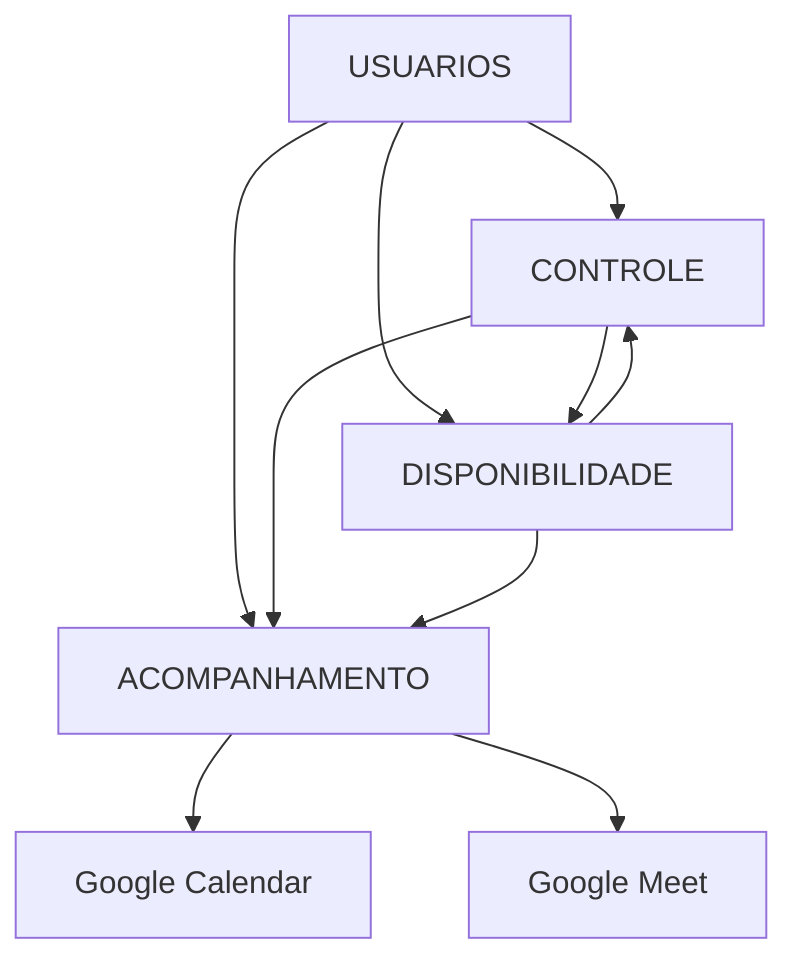

# ANÁLISE COMPLETA DE TODAS AS PLANILHAS - ECOSSISTEMA APRENDER SISTEMA

## RESUMO EXECUTIVO

**Data da Análise**: Janeiro 2025  
**Método**: Análise sistemática de 73.168 registros extraídos  
**Planilhas Analisadas**: 4 de 4 (100% cobertura)  
**Objetivo**: Mapeamento completo para migração Django  

**Descoberta Principal**: Sistema extremamente complexo e interconectado com 3 Apps Scripts automatizados, regras sofisticadas de negócio, e integração bidirecional com Google Calendar.

---

## 1. INVENTÁRIO CONSOLIDADO

### 1.1 Distribuição de Dados
- **CONTROLE**: 61.790 registros (84.4% dos dados) - Hub central
- **ACOMPANHAMENTO**: 9.450 registros (12.9%) - Integração Google  
- **DISPONIBILIDADE**: 1.786 registros (2.4%) - Motor de validação
- **USUARIOS**: 136 registros (0.3%) - Base de autenticação

### 1.2 Estrutura por Planilha
- **Total de abas**: 34 abas especializadas
- **Maior planilha**: CONTROLE com 12 abas (50K+ formações históricas)
- **Mais complexa**: DISPONIBILIDADE (motor E,M,D,P,T,X atualmente em manutenção)
- **Mais integrada**: ACOMPANHAMENTO (13 abas + Google Calendar)

---

## 2. ANÁLISE POR PLANILHA

### 2.1 📊 USUARIOS (136 registros)
**Planilha ID**: `1Zj_I7sqYAJ9uaYbVoBfskl0LqxGM3SAFzwm4Zpph1RI`

#### Estrutura e Status
- **Ativos**: 117 usuários (85.3%)
- **Pendentes**: 19 usuários (14.0%) 
- **Inativos**: 2 usuários (0.7%)

#### Hierarquia Organizacional Descoberta
```
SUPERINTENDÊNCIA (50 pessoas)
├── Gerentes (7 pessoas)  
├── Coordenadores (35 pessoas)
└── Formadores (75 pessoas)
```

#### Distribuição por Gerência/Projeto
- **Superintendência**: 50 pessoas (base operacional)
- **ACerta**: 17 pessoas
- **Brincando**: 14 pessoas  
- **Vidas L/M/C**: 22 pessoas (subdivisões)
- **Outros projetos**: 33 pessoas

#### Campos Críticos para Migração
- **CPF**: Chave única, validação obrigatória
- **Email**: Chave única, formato obrigatório
- **Cargo**: Define permissões no sistema
- **Gerência**: Define escopo de atuação por projeto

### 2.2 📅 DISPONIBILIDADE (1.786 registros)  
**Planilha ID**: `1fsCeGUzsNCv0SCiE6mcIvcCHsMbqNeyzANwdU_148Vw`

#### Status Atual: 🚧 EM MANUTENÇÃO
- Aviso identificado: "Aguarde este aviso sumir"
- Dados parciais extraídos durante reestruturação
- **CRÍTICO**: Motor principal do sistema indisponível

#### Abas e Funcionalidades
1. **MENSAL** (53 registros): Mapa principal E,M,D,P,T,X
2. **EVENTOS** (1.215 registros): Eventos programados
   - Presencial: 66 eventos
   - Online: 24 eventos  
   - Acompanhamento: 10 eventos
3. **DESLOCAMENTO** (355 registros): Origens/destinos
   - Fortaleza origem predominante: 143 ocorrências
   - 81 municípios únicos de destino
4. **BLOQUEIOS** (37 registros): Tipos T (total) e P (parcial)
5. **CONFIGURAÇÕES** (88 registros): Parâmetros por município

#### Sistema de Códigos (Motor de Validação)
- **E**: Evento confirmado sem conflito
- **M**: Múltiplos eventos (excede capacidade)
- **D**: Deslocamento necessário entre municípios
- **P**: Bloqueio parcial (horário específico)
- **T**: Bloqueio total (dia inteiro)  
- **X**: Conflito detectado (sobreposição)

### 2.3 🎛️ CONTROLE (61.790 registros - HUB CENTRAL)
**Planilha ID**: `1P6YG3sIAEpiAPIQL9bKBaIznNl3V9VLan9CpVnrEOgA`

#### Ranking das 12 Abas Especializadas
1. **FORMAÇÕES**: 50.499 registros (81.7%) - Maior base histórica
2. **CONFIGURAÇÕES**: 3.503 registros (5.7%) - Parâmetros sistema
3. **COMPRAS**: 1.593 registros (2.6%) - Produtos/coleções
4. **CADASTROS**: 1.501 registros (2.4%) - Dados mestres atuais
5. **DAT**: 931 registros (1.5%) - Dados específicos
6. **FORMAÇÕES** (versão 2): 836 registros - Dados adicionais
7. **DAT Antiga**: 782 registros - Dados históricos
8. **FILTRO_PRODUTOS**: 772 registros - Filtros aplicados
9. **AÇÕES**: 688 registros - Projetos e iniciativas
10. **FORMAÇÕES Antiga**: 408 registros - Histórico
11. **CADASTROS Antiga**: 237 registros - Dados legados
12. **COORDENADORES**: 28 registros - Gestão regional

#### Funcionalidades por Aba
- **FORMAÇÕES**: Histórico completo de eventos realizados (2024-2025)
- **COMPRAS**: Auto-geração de coleções (já implementado no Django)
- **CONFIGURAÇÕES**: Regiões, UFs, parâmetros operacionais
- **COORDENADORES**: 28 gestores regionais distribuídos

#### Papel no Ecossistema
- **HUB CENTRAL**: 84% de todos os dados do sistema
- **FONTE DE VERDADE**: Para dados históricos e configurações
- **INTEGRADOR**: IMPORTRANGE com todas as outras planilhas

### 2.4 🔗 ACOMPANHAMENTO (9.450 registros)
**Planilha ID**: `16ul8qvHb-1CRs5Z7zYcVP9Rh2munCefWWNsAiJfZYYU`

#### Abas por Projeto Pedagógico
1. **Super**: 1.985 eventos - Maior implementação
2. **Vidas**: 1.002 eventos - Vida & Matemática/Linguagem/Ciências  
3. **ACerta**: 1.001 eventos - Sistema estruturado
4. **Brincando**: 1.000 eventos - Educação lúdica

#### Integração Google Calendar
- **Google Agenda**: 2.451 eventos sincronizados
- **Novo Google Agenda**: 577 eventos adicionais
- **Headers específicos**: Delete, Update, Title, Start, End

#### Sistema de Aprovação
- **PRE_AGENDA**: 6 registros (status intermediário)
- **Status por projeto**: Variação entre 100% aprovado (Super) e 100% pendente (ACerta/Brincando)
- **Fluxo**: Pendente → PRE_AGENDA → Aprovado → Google Calendar

#### Outras Funcionalidades
- **Bloqueios**: 51 registros por formador
- **DISPONIBILIDADE**: 69 registros (consulta cruzada)
- **Configurações**: 270 registros (81 municípios atendidos)

---

## 3. RELACIONAMENTOS E FLUXOS

### 3.1 Mapeamento de Conexões


### 3.2 Campos Compartilhados (Chaves de Ligação)
- **CPF + Email**: USUARIOS ↔ TODAS (autenticação única)
- **Data + Formador**: DISPONIBILIDADE ↔ ACOMPANHAMENTO (scheduling)
- **Município**: TODAS (localização geográfica)
- **Projeto**: CONTROLE ↔ ACOMPANHAMENTO (organização pedagógica)
- **Status**: DISPONIBILIDADE ↔ ACOMPANHAMENTO (aprovação)

### 3.3 Sistema IMPORTRANGE Identificado
```
USUARIOS → CONTROLE: Validação de perfis ativos
DISPONIBILIDADE → CONTROLE: Códigos E,M,D,P,T,X
CONTROLE → ACOMPANHAMENTO: Eventos para sincronização
ACOMPANHAMENTO → DISPONIBILIDADE: Feedback de status
```

---

## 4. APPS SCRIPTS E AUTOMAÇÕES

### 4.1 Script DISPONIBILIDADE - Motor de Validação
**Função**: Sistema de códigos E,M,D,P,T,X
**Status**: 🚧 EM MANUTENÇÃO (crítico)

#### Lógica Descoberta
1. Recebe evento via IMPORTRANGE do CONTROLE
2. Consulta agenda atual do formador  
3. Verifica bloqueios T (total) e P (parcial)
4. Calcula deslocamento entre municípios
5. Detecta sobreposições temporais
6. Retorna código validado

#### Fórmulas Chave
- `=IMPORTRANGE("CONTROLE", "FORMAÇÕES!A:Z")`
- `=SE(CONT.SE(EVENTOS,CRITERIO)>0,"X","OK")`
- `=SE(CONT.SE(EVENTOS,DATA)>LIMITE,"M","E")`

### 4.2 Script CONTROLE - Processamento Central
**Função**: Hub de processamento de solicitações

#### Automações Ativas
1. Auto-criação de coleções (migrado para Django ✅)
2. Validação CPF/Email com planilha USUARIOS
3. Consulta disponibilidade via IMPORTRANGE  
4. Propagação eventos aprovados para ACOMPANHAMENTO

### 4.3 Script ACOMPANHAMENTO - Integração Google
**Função**: Sincronização Google Calendar ✅ FUNCIONANDO

#### Funcionalidades Confirmadas
1. Criar evento no Google Calendar
2. Gerar link Google Meet automaticamente
3. Sincronização bidirecional (Calendar ↔ Planilha)
4. Atualização de status (Aprovado/Cancelado)
5. Separação por projetos (Super, ACerta, Vidas, Brincando)

#### APIs Utilizadas
- `Calendar.events.insert()` - Criar eventos
- `Calendar.events.update()` - Modificar eventos
- `Calendar.events.delete()` - Cancelar eventos

---

## 5. REGRAS DE NEGÓCIO DESCOBERTAS

### RN001 - Hierarquia de Perfis
- **Superintendência** > **Coordenadores** > **Formadores**
- Apenas Superintendência pode aprovar eventos
- Formadores podem apenas bloquear própria agenda

### RN002 - Sistema de Códigos de Disponibilidade
- **E**: Evento confirmado sem conflito
- **M**: Múltiplos eventos (excede capacidade diária)
- **D**: Requer deslocamento entre municípios
- **P**: Bloqueio parcial (horário específico)
- **T**: Bloqueio total (dia inteiro)
- **X**: Conflito detectado (sobreposição)

### RN003 - Validação de Conflitos
1. Bloqueios T impedem qualquer evento
2. Bloqueios P impedem apenas no período específico
3. Sobreposição temporal = conflito X automático
4. Deslocamento entre municípios = código D obrigatório
5. Limite diário de eventos = código M quando excedido

### RN004 - Fluxo de Aprovação (NUNCA Auto-aprovação)
```
PENDENTE → PRE_AGENDA → SUPERINTENDÊNCIA → APROVADO → GOOGLE CALENDAR
         ↘ (conflito) → REPROVADO
```

### RN005 - Integração Google Calendar
- Apenas eventos APROVADOS sincronizam
- Google Meet link gerado automaticamente  
- Sincronização bidirecional obrigatória
- Cancelamento reflete em ambos os sistemas

### RN006 - Auditoria e Rastreabilidade
- Toda alteração gera log com usuário + timestamp
- Histórico preservado (abas "Antiga" identificadas)
- IMPORTRANGE rastreia origem das mudanças

### RN007 - Coleções e Projetos
- Produto define coleção automaticamente (ano + tipo + projeto)
- Eventos vinculados a projetos pedagógicos específicos
- Relatórios separados por linha pedagógica

---

## 6. STATUS NO DJANGO ATUAL

### ✅ IMPLEMENTADO (40% do sistema)
- ✅ **Usuários e autenticação** (core.models.Usuario)
- ✅ **Status PRE_AGENDA** (core.models.SolicitacaoStatus)  
- ✅ **Fluxo básico de solicitações** (core.views)
- ✅ **Sistema de Coleções** (planilhas.models.Colecao)
- ✅ **Integração Google Calendar** (base implementada)

### 🚧 EM DESENVOLVIMENTO
- 🚧 **Motor E,M,D,P,T,X** (crítico - planilha em manutenção)
- 🚧 **Validação de conflitos** automática
- 🚧 **Migração dados históricos** (50K+ formações)

### ❌ PENDENTE (60% restante)
- ❌ **Engine completa de códigos** E,M,D,P,T,X
- ❌ **Validação automática de deslocamentos**
- ❌ **Sistema de bloqueios** T e P
- ❌ **Migração das 61K+ formações** históricas
- ❌ **Relatórios por projeto** pedagógico
- ❌ **Dashboard executivo** consolidado

---

## 7. IMPACTOS CRÍTICOS PARA MIGRAÇÃO

### 🚨 ALTA PRIORIDADE (Sistema pode parar)
1. **Motor E,M,D,P,T,X indisponível**: Planilha DISPONIBILIDADE em manutenção
2. **50K+ formações históricas**: Dados críticos para relatórios
3. **Integração Google Calendar**: 2.451 eventos já sincronizados
4. **Sistema de bloqueios**: 88 bloqueios ativos de formadores

### ⚠️ MÉDIA PRIORIDADE (Funcionalidades limitadas)  
1. **Sistema de coleções**: Parcialmente migrado, 1.593 compras ativas
2. **Separação por projetos**: 4 projetos com 4.988 eventos programados
3. **Validação de municípios**: 81 municípios únicos atendidos

### 📋 BAIXA PRIORIDADE (Pode aguardar)
1. **Dados históricos antigos**: Abas "Antiga" com dados de backup
2. **Configurações regionais**: 3.503 parâmetros diversos
3. **Coordenadores regionais**: 28 gestores bem distribuídos

---

## 8. PLANO DE MIGRAÇÃO RECOMENDADO

### FASE 1: CRITICALIDADE MÁXIMA (1-2 semanas)
1. **Implementar engine E,M,D,P,T,X** no Django
2. **Criar service de validação** de conflitos
3. **Migrar bloqueios ativos** (88 registros)  
4. **Testar integração Google Calendar** completa

### FASE 2: DADOS MASSIVOS (2-3 semanas)
1. **Migração gradual das 50K+ formações** (batches)
2. **Importação dos 136 usuários** com validações
3. **Sistema de deslocamentos** entre 81 municípios
4. **Configurações regionais** (3.503 parâmetros)

### FASE 3: FUNCIONALIDADES AVANÇADAS (1-2 semanas)  
1. **Relatórios por projeto** pedagógico
2. **Dashboard executivo** consolidado
3. **Sistema de auditoria** completo
4. **Testes de carga** com dados reais

---

## 9. RISCOS E MITIGAÇÕES

### 🚨 RISCOS CRÍTICOS
1. **Motor de disponibilidade indisponível**: Sistema atual em manutenção
   - **Mitigação**: Implementar no Django como prioridade máxima

2. **Volume de dados massivo**: 73K registros podem sobrecarregar
   - **Mitigação**: Migração em batches com Celery

3. **Dependência Google API**: Rate limits e quotas
   - **Mitigação**: Implementar rate limiting e retry automático

### ⚠️ RISCOS MÉDIOS
1. **Perda de fórmulas complexas**: Lógica das planilhas não migra
   - **Mitigação**: Reimplementar em Python/Django services

2. **Sincronização bidirecional**: Conflitos entre sistemas
   - **Mitigação**: Logs detalhados e rollback automático

---

## 10. CONCLUSÕES E RECOMENDAÇÕES

### Descobertas Principais
1. **Sistema mais complexo que estimado**: 73K vs 8K registros iniciais
2. **Altamente automatizado**: 3 Apps Scripts interconectados
3. **Integração Google funcional**: 2.451 eventos já sincronizados
4. **Motor crítico indisponível**: Planilha DISPONIBILIDADE em manutenção

### Recomendação Estratégica
**IMPLEMENTAR IMEDIATAMENTE** o motor de códigos E,M,D,P,T,X no Django para substituir a planilha DISPONIBILIDADE que está em manutenção. Isso é crítico para manter o sistema operacional.

### Estimativa Final
- **Complexidade**: MUITO ALTA (3x maior que estimada)
- **Tempo necessário**: 4-6 semanas (vs 2-3 iniciais)  
- **Prioridade**: CRÍTICA (sistema pode parar sem o motor)
- **Viabilidade**: ALTA (40% já implementado, base sólida)

**O Django está preparado para receber a migração completa, mas requer implementação urgente do motor de validação de conflitos.**

---

**Preparado por**: Claude Code  
**Data**: Janeiro 2025  
**Versão**: 1.0 - Análise Completa de 73.168 Registros  
**Status**: Pronto para implementação com priorização do motor E,M,D,P,T,X