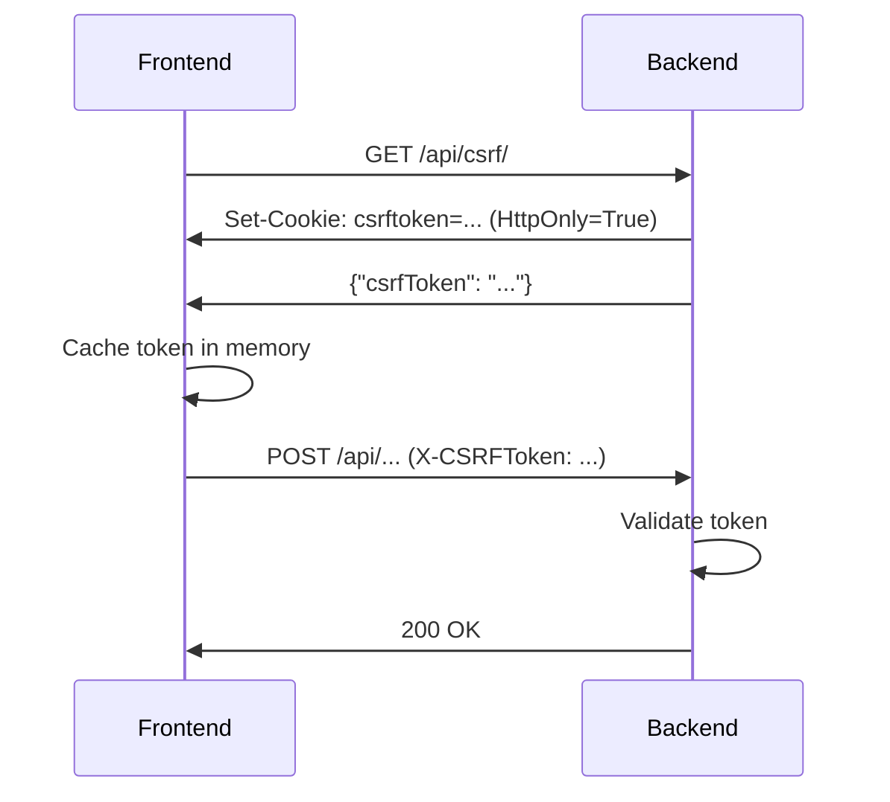

# Security Policy — Aprender Sistema v2

## Reporting Security Vulnerabilities

If you discover a security vulnerability, please report it to:
- **Email**: security@aprender.gov.br (ou via GitHub Security Advisories)
- **GitHub Security Advisories**: https://github.com/matheusnorjosa/aprender_sistema/security/advisories

**DO NOT** create public issues for security vulnerabilities.

---

## Implemented Security Measures

### 1. Rate Limiting (SEC-P1) ✅

**Endpoint**: `POST /api/auth/login/`

**Protection**: Brute force attack prevention via IP-based rate limiting.

**Configuration**:
```python
# apps/core/views_auth.py
class LoginThrottle(AnonRateThrottle):
    rate = '5/minute'  # 5 login attempts per minute per IP
```

**Behavior**:
- ✅ First 5 login attempts within 1 minute: **Allowed** (200/400 depending on credentials)
- ❌ 6th+ login attempts within 1 minute: **Blocked** (429 Too Many Requests)
- ⏱️ After 1 minute window: Rate limit resets automatically
- 🔒 Per-IP throttling: Each IP address has independent limit

**HTTP Status Codes**:
| Scenario | Status Code | Description |
|----------|-------------|-------------|
| Valid credentials | `200 OK` | Login successful |
| Invalid credentials | `400 Bad Request` | Wrong username/password |
| Rate limit exceeded | `429 Too Many Requests` | Too many attempts, try again later |

**Example Response (429)**:
```json
{
  "detail": "Request was throttled. Expected available in 42 seconds."
}
```

**Adjusting Rate Limit** (if needed):
```python
# In settings.py (optional, if you want centralized config)
REST_FRAMEWORK = {
    'DEFAULT_THROTTLE_RATES': {
        'anon': '100/hour',  # Default for anonymous users
        'user': '1000/hour',  # Default for authenticated users
        # LoginThrottle uses '5/minute' directly (no setting needed)
    }
}
```

**Security Notes**:
- ⚠️ Throttling is applied **BEFORE** credential validation (does not leak info about valid usernames)
- 🛡️ Uses `AnonRateThrottle` (IP-based, works for unauthenticated requests)
- 📊 Tracked via Django cache (Redis in production, SimpleCache in dev)
- 🚫 Cannot be bypassed by sending invalid payloads (empty credentials also count)

**Testing**:
```bash
# Run throttling tests
cd v2/infra
docker compose exec -T web pytest apps/core/tests/test_login_throttle_behavior.py -v

# Test manually with curl
for i in {1..6}; do
  echo "Request $i:"
  curl -X POST http://localhost:8002/api/auth/login/ \
    -H "Content-Type: application/json" \
    -d '{"username":"test","password":"test"}' \
    -w "\nHTTP Status: %{http_code}\n\n"
done
```

---

### 2. Upload Validation (P0) ✅

**Endpoints**:
- `POST /api/controle/import-acoes/`
- `POST /api/dat/import-cadastros/`

**Protection**: DoS prevention + malicious file blocking.

**Configuration**:
```python
# apps/core/views_imports.py
MAX_UPLOAD_SIZE = 10 * 1024 * 1024  # 10MB
ALLOWED_CONTENT_TYPES = {
    'text/csv',
    'application/vnd.ms-excel',
    'application/vnd.openxmlformats-officedocument.spreadsheetml.sheet',
}
```

**Validations**:
- ✅ **File size**: Max 10MB (prevents DoS via large files)
- ✅ **MIME type**: Only CSV, XLS, XLSX (blocks .exe, .sh, .pdf, etc.)
- ✅ **Extension check**: Validates via `content_type` header (not file extension)

**HTTP Status Codes**:
| Validation | Status Code | Description |
|------------|-------------|-------------|
| Valid upload | `200 OK` | File processed successfully |
| File too large | `413 Request Entity Too Large` | Max size: 10MB |
| Invalid MIME type | `400 Bad Request` | Only CSV/XLS/XLSX allowed |
| Missing file | `400 Bad Request` | Field 'file' is required |

**Example Response (413)**:
```json
{
  "detail": "Arquivo muito grande. Máximo: 10MB"
}
```

**Example Response (400 - Invalid MIME)**:
```json
{
  "detail": "Tipo de arquivo não permitido. Aceitos: CSV, XLS, XLSX. Recebido: application/x-executable"
}
```

---

### 3. Authentication Audit (PA-05) ✅

**Protection**: Complete audit trail for authentication events.

**Events Logged**:
- ✅ **LOGIN**: User login (success only)
- ✅ **LOGOUT**: User logout

**AuditLog Fields**:
```python
{
  "usuario": User,
  "action": "LOGIN" | "LOGOUT",
  "model_name": "Usuario",
  "details": {
    "ip_address": "192.168.1.1",
    "user_agent": "Mozilla/5.0 ...",
    # Additional context
  },
  "created_at": "2025-11-14T18:00:00Z"
}
```

**Querying Audit Logs**:
```python
from apps.core.models import AuditLog

# All login events
logins = AuditLog.objects.filter(action='LOGIN')

# User-specific events
user_events = AuditLog.objects.filter(usuario=user)

# Recent events (last 24h)
from django.utils import timezone
from datetime import timedelta
recent = AuditLog.objects.filter(
    created_at__gte=timezone.now() - timedelta(days=1)
)
```

---

### 4. CSRF HttpOnly Protection (SEC-P2) ✅

**Endpoint**: `GET /api/csrf/`

**Protection**: XSS protection by preventing JavaScript from reading CSRF cookie directly.

**Configuration**:
```python
# config/settings.py
CSRF_COOKIE_HTTPONLY = True  # JavaScript cannot read cookie
CSRF_COOKIE_SAMESITE = 'Lax'  # CSRF attack prevention
```

**Behavior**:
- ✅ CSRF cookie is set with `HttpOnly=True` (not accessible via `document.cookie`)
- ✅ Frontend calls `/api/csrf/` to get token in response body (JSON)
- ✅ Token is sent in `X-CSRFToken` header for mutating requests (POST/PUT/PATCH/DELETE)
- ✅ Protects against XSS attacks stealing CSRF tokens

**How It Works**:


**Frontend Implementation**:
```javascript
// v2/frontend/src/api/config.js
export async function ensureCsrfToken() {
  // 1. Try reading from cookie (backward compatibility)
  let token = getCsrfToken();
  if (token) return token;

  // 2. Use memory cache
  if (cachedCsrfToken) return cachedCsrfToken;

  // 3. Fetch from endpoint (Issue #135)
  const response = await fetch('/api/csrf/');
  const data = await response.json();
  cachedCsrfToken = data.csrfToken;
  return cachedCsrfToken;
}
```

**HTTP Status Codes**:
| Scenario | Status Code | Description |
|----------|-------------|-------------|
| Get token | `200 OK` | Token returned in body |
| Missing CSRF | `403 Forbidden` | Mutating request without token |

**Example Request/Response**:
```bash
# Get CSRF token
curl http://localhost:8002/api/csrf/ -c cookies.txt

# Response
{"csrfToken": "abc123..."}

# Use token in mutating request
curl http://localhost:8002/api/solicitacoes/ \
  -X POST \
  -H "X-CSRFToken: abc123..." \
  -H "Content-Type: application/json" \
  -b cookies.txt \
  -d '{"titulo": "..."}'
```

**Security Notes**:
- ⚠️ Login endpoint (`/api/auth/login/`) does NOT require CSRF (entry point for authentication)
- 🛡️ CSRF is enforced on endpoints using `SessionAuthentication` after login
- 📊 Token is cached in memory (not localStorage to avoid XSS)
- 🚫 HttpOnly prevents XSS attacks from stealing token

**Testing**:
```bash
# Run CSRF HttpOnly tests
cd v2/infra
docker compose exec -T web pytest apps/core/tests/test_csrf_httponly.py -v
```

**Backward Compatibility**:
- Frontend tries to read from cookie first (if HttpOnly=False)
- Falls back to `/api/csrf/` endpoint if cookie not readable
- Works with both HttpOnly=True (secure) and HttpOnly=False (legacy)

---

### 5. Inactive User Blocking ✅

**Protection**: Prevents login by deactivated users.

**Behavior**:
- ✅ Active users (`is_active=True`): Login allowed (if credentials valid)
- ❌ Inactive users (`is_active=False`): Login blocked (returns `400 Bad Request`)
- 🔒 Handled by `CPFOrUsernameBackend.user_can_authenticate()`

**Example Response (Inactive User)**:
```json
{
  "error": "Credenciais inválidas."
}
```

**Note**: Message is intentionally generic to avoid leaking information about user existence/status.

---

## Security Checklist for Deployment

### Django Settings
- [ ] `DEBUG = False` in production
- [ ] `SECRET_KEY` stored in environment variable (not hardcoded)
- [ ] `ALLOWED_HOSTS` configured with production domain(s)
- [ ] `SECURE_SSL_REDIRECT = True` (force HTTPS)
- [ ] `SESSION_COOKIE_SECURE = True` (HTTPS-only cookies)
- [ ] `CSRF_COOKIE_SECURE = True` (HTTPS-only CSRF)
- [ ] `SECURE_HSTS_SECONDS = 31536000` (1 year HSTS)

### Database
- [ ] PostgreSQL user has minimal privileges (no superuser)
- [ ] Database password stored in environment variable
- [ ] Regular backups configured
- [ ] Connection limited to localhost/internal network

### Cache (Redis)
- [ ] Redis password configured (`REDIS_PASSWORD`)
- [ ] Redis bound to localhost (not 0.0.0.0)
- [ ] Persistence enabled (AOF or RDB)

### Google Calendar API
- [ ] Service Account credentials stored securely
- [ ] Minimal scopes granted (calendar.events only)
- [ ] Calendar ID not exposed in frontend

### Monitoring
- [ ] Rate limit violations logged
- [ ] Failed login attempts monitored
- [ ] Unusual upload activity tracked

---

## Known Limitations

### Rate Limiting
- **Bypass via distributed IPs**: Attacker with botnet can use multiple IPs to bypass per-IP limit
  - **Mitigation**: Consider Cloudflare rate limiting or WAF
- **Shared IP environments**: Users behind NAT/proxy share IP limit
  - **Mitigation**: Increase rate to `10/minute` if false positives occur

### Upload Validation
- **MIME type spoofing**: Attacker can fake `Content-Type` header
  - **Mitigation**: Backend validates file content (not just header) via openpyxl/csv
- **Zip bombs**: Compressed files can expand to huge size
  - **Mitigation**: 10MB limit applies to **uploaded** size (not expanded)

### Audit Logs
- **No log retention policy**: Logs grow indefinitely
  - **Mitigation**: Implement log rotation/archival (future work)

---

## Incident Response

### Rate Limit False Positive
If legitimate users report 429 errors:

1. **Check logs** for IP address:
   ```bash
   docker compose exec -T web python manage.py shell
   from django.core.cache import cache
   cache.get('throttle_anon_192.168.1.100')  # Check throttle state
   ```

2. **Clear throttle for specific IP** (emergency):
   ```python
   cache.delete('throttle_anon_192.168.1.100')
   ```

3. **Increase rate limit** temporarily:
   ```python
   # apps/core/views_auth.py
   class LoginThrottle(AnonRateThrottle):
       rate = '10/minute'  # Increased from 5/minute
   ```

### Suspected Brute Force Attack
If logs show sustained 429 errors from single IP:

1. **Block IP at firewall level**:
   ```bash
   # iptables (Linux)
   sudo iptables -A INPUT -s 192.168.1.100 -j DROP
   ```

2. **Monitor AuditLog** for successful logins from that IP:
   ```python
   AuditLog.objects.filter(
       action='LOGIN',
       details__ip_address='192.168.1.100'
   )
   ```

3. **Force logout** if breach occurred:
   ```python
   from django.contrib.sessions.models import Session
   Session.objects.all().delete()  # Nuclear option
   ```

---

## Future Security Improvements

### Planned (Issues Created)
- [x] **Issue #135**: CSRF_COOKIE_HTTPONLY=True (XSS protection) ✅ **IMPLEMENTED** (see section 4)
- [x] **Issue #136**: CheckConstraints for model choices (data integrity) ✅ **IMPLEMENTED** (PR #142)

### Backlog
- [ ] Two-factor authentication (2FA) for Superintendência
- [ ] Login attempt monitoring/alerting
- [ ] CAPTCHA after 3 failed attempts
- [ ] Account lockout after 10 failed attempts (1 hour)
- [ ] Security headers (Content-Security-Policy, X-Frame-Options)
- [ ] API key authentication for service-to-service calls
- [ ] Log retention policy (90 days)

---

## Compliance

### OWASP Top 10 2021 Coverage
| Risk | Mitigation | Status |
|------|------------|--------|
| A01: Broken Access Control | RBAC + permissions | ✅ |
| A02: Cryptographic Failures | HTTPS + secure cookies | ⚠️ Partial |
| A03: Injection | Django ORM + parameterized queries | ✅ |
| A04: Insecure Design | Upload validation + rate limiting | ✅ |
| A05: Security Misconfiguration | Environment variables + DEBUG=False | ✅ |
| A06: Vulnerable Components | Regular dependency updates | ⚠️ Manual |
| A07: Authentication Failures | Rate limiting + audit logs | ✅ |
| A08: Software and Data Integrity | File validation + checksums | ⚠️ Partial |
| A09: Logging Failures | AuditLog model | ✅ |
| A10: SSRF | No user-controlled URLs | ✅ |

---

## Contact

For security concerns, contact:
- **Security Team**: security@aprender.gov.br
- **Project Lead**: Matheus Norjosa (@matheusnorjosa)

Last updated: 2026-01-05
