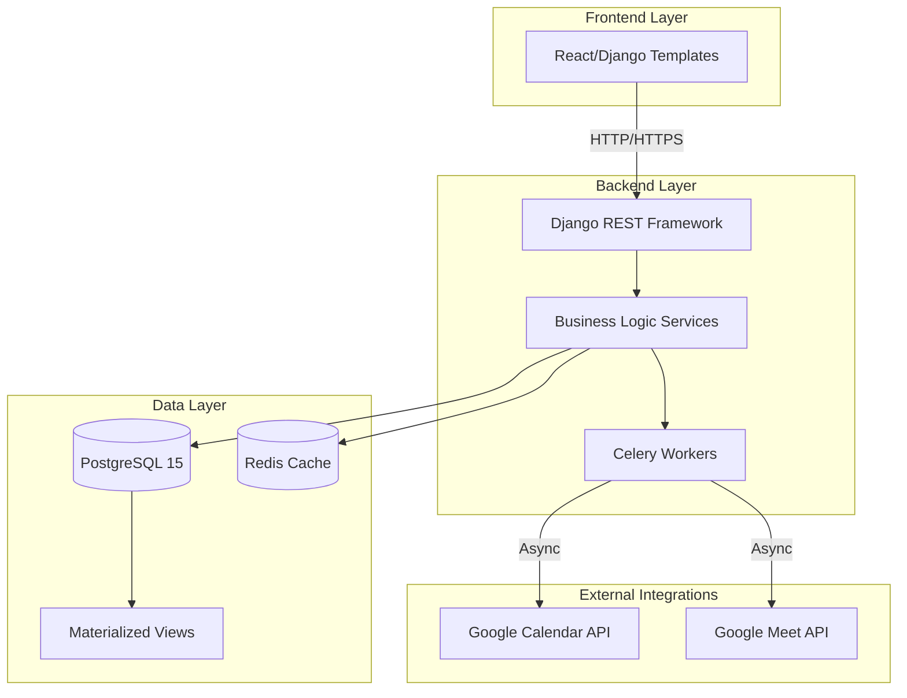
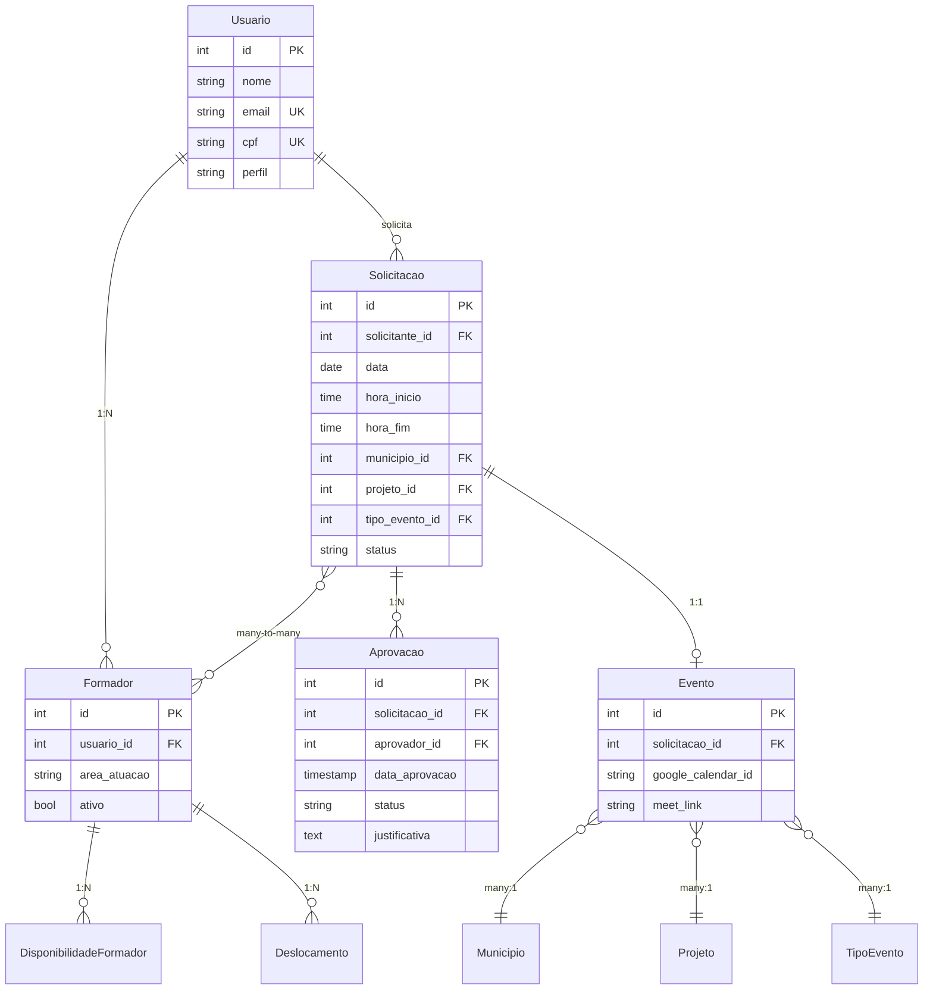
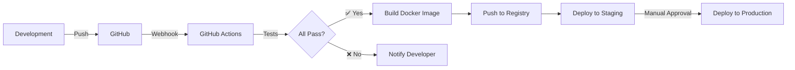

# 🏗️ AS v2 — Blueprint Arquitetural

**Versão**: 2.0.0
**Data**: 2025-10-10
**Status**: 🚧 Em Construção

---

## 🎯 Visão Geral

O **Aprender Sistema v2 (AS v2)** é uma reescrita completa do sistema de gestão de eventos e disponibilidade de formadores, substituindo as planilhas Excel/Google Sheets por uma aplicação web moderna com arquitetura de microsserviços.

### Objetivos Estratégicos

1. **Eliminar Dependências Externas**
   - ❌ Remover IMPORTRANGE (dependência Google Sheets)
   - ✅ Single Source of Truth em PostgreSQL
   - ✅ Integração assíncrona com Google Calendar

2. **Performance & Escalabilidade**
   - De 82K fórmulas Excel → Queries SQL otimizadas
   - Materialized Views para agregações pesadas
   - Cache Redis para dados frequentes

3. **Auditabilidade & Compliance**
   - LogAuditoria completo (quem, quando, o quê)
   - Histórico de mudanças (django-simple-history)
   - Rastreabilidade de aprovações

4. **UX/UI Moderna**
   - Feedback em tempo real (validação assíncrona)
   - Mobile-first (Bootstrap 5)
   - Acessibilidade (WCAG 2.1 AA)

---

## 🏛️ Arquitetura de Alto Nível



---

## 📦 Estrutura de Módulos

### Backend (`v2/backend/`)

```
backend/
├── apps/
│   ├── core/                      # App principal (modelos de domínio)
│   │   ├── models/
│   │   │   ├── usuario.py         # Usuario, Formador, Perfil
│   │   │   ├── evento.py          # Solicitacao, Evento, Aprovacao
│   │   │   ├── disponibilidade.py # Bloqueio, Deslocamento
│   │   │   └── auditoria.py       # LogAuditoria
│   │   ├── services/              # Lógica de negócio
│   │   │   ├── conflict_checker.py
│   │   │   ├── disponibilidade_service.py
│   │   │   └── approval_workflow.py
│   │   └── views/                 # Views Django (templates)
│   │
│   └── dat_ingest/                # App de ingestão (ETL)
│       ├── management/commands/
│       │   ├── etl_agenda.py
│       │   ├── etl_controle.py
│       │   └── etl_usuarios.py
│       ├── serializers.py         # DRF serializers
│       └── views.py               # API endpoints (POST /ingest/)
│
├── services/                      # Serviços compartilhados
│   ├── integrations/
│   │   ├── google_calendar.py
│   │   └── google_meet.py
│   └── utils/
│       ├── validators.py
│       └── helpers.py
│
└── config/                        # Configuração Django
    ├── settings/
    │   ├── base.py
    │   ├── development.py
    │   ├── staging.py
    │   └── production.py
    ├── urls.py
    └── wsgi.py
```

### Frontend (`v2/frontend/`)

**Opção A**: Vite + React (SPA)
```
frontend/
├── src/
│   ├── components/
│   │   ├── Calendar/
│   │   ├── Forms/
│   │   └── Dashboard/
│   ├── pages/
│   │   ├── Solicitacao.tsx
│   │   ├── Aprovacao.tsx
│   │   └── Disponibilidade.tsx
│   ├── services/
│   │   └── api.ts          # Axios client
│   └── App.tsx
└── package.json
```

**Opção B**: Django Templates + Alpine.js (Server-Side Rendering)
```
backend/apps/core/templates/
├── base.html
├── solicitacao/
│   ├── form.html
│   └── list.html
└── disponibilidade/
    └── calendar.html
```

**Recomendação**: Opção B (Django Templates) para MVP, migrar para React em v2.1+

### Infraestrutura (`v2/infra/`)

```
infra/
├── Dockerfile                     # Multi-stage build
├── docker-compose.yml             # Orquestração local
├── docker-compose.prod.yml        # Produção
├── entrypoint.sh                  # Script de inicialização
├── Makefile                       # Comandos unificados
└── nginx/
    └── aprender.conf              # Configuração Nginx
```

### Documentação (`v2/docs/`)

```
docs/
├── BLUEPRINT.md                   # Este arquivo
├── SINGLE_SOURCE_OF_TRUTH.md     # Regras de integridade de dados
├── MIGRATION_PLAN.md              # Plano de migração v1 → v2
├── TESTS_PLAN.md                  # Estratégia de testes
├── API.md                         # Documentação de endpoints
└── CLAUDE.md                      # Instruções para Claude Code
```

---

## 🗄️ Modelagem de Dados (ERD Simplificado)



---

## 🔧 Stack Tecnológico

### Backend

| Camada | Tecnologia | Versão | Justificativa |
|--------|------------|--------|---------------|
| **Framework** | Django | 5.2.x | Batteries included, Django Admin, ORM robusto |
| **API** | Django REST Framework | 3.15.x | Serialization, ViewSets, permissions |
| **Database** | PostgreSQL | 15.x | JSONB, MVs, índices avançados |
| **Cache** | Redis | 7.x | Session store, cache de queries, Celery broker |
| **Task Queue** | Celery | 5.4.x | Tarefas assíncronas (integração Google) |
| **WSGI Server** | Gunicorn | 22.x | Production-ready, worker management |
| **Reverse Proxy** | Nginx | 1.25.x | Static files, SSL termination, load balancing |

### Frontend

| Camada | Tecnologia | Versão | Justificativa |
|--------|------------|--------|---------------|
| **Templates** | Django Templates | 5.2.x | SSR, integração com Django Forms |
| **CSS Framework** | Bootstrap | 5.3.x | Mobile-first, componentes prontos |
| **JS Enhancements** | Alpine.js | 3.x | Reatividade leve, sem build step |
| **Charts** | Chart.js | 4.x | Gráficos no dashboard |

### DevOps

| Ferramenta | Tecnologia | Versão | Justificativa |
|-----------|------------|--------|---------------|
| **Containerização** | Docker | 24.x | Ambiente consistente dev/staging/prod |
| **Orquestração** | Docker Compose | 2.x | Multi-container apps |
| **CI/CD** | GitHub Actions | - | Testes automatizados, deploy |
| **Monitoring** | Sentry | Latest | Error tracking, performance monitoring |
| **Logs** | Elasticsearch + Kibana | 8.x | Centralização de logs, análise |

---

## 🔐 Segurança & Compliance

### Autenticação & Autorização

- **Django Groups & Permissions**: RBAC nativo
- **Session-based Auth**: Cookie seguro (HttpOnly, Secure, SameSite)
- **CSRF Protection**: Token em todos os forms
- **Password Hashing**: Argon2 (mais seguro que PBKDF2)

### Proteção de Dados (LGPD)

- **Dados Sensíveis**: CPF, email criptografados em repouso
- **Logs de Auditoria**: Rastreamento completo de acessos
- **Consentimento**: Termo de uso + política de privacidade
- **Direito ao Esquecimento**: Comando Django para anonimização

### Validação de Entrada

- **Django Forms**: Validação no backend (nunca confiar no frontend)
- **DRF Serializers**: Validação de APIs
- **Database Constraints**: CHECK, NOT NULL, UNIQUE no PostgreSQL
- **Rate Limiting**: Throttling em endpoints críticos (DRF)

---

## 🚀 Deployment Pipeline



### Environments

| Environment | Branch | URL | Deploy | Database |
|-------------|--------|-----|--------|----------|
| **Development** | `*` | localhost:8000 | Manual | SQLite/PostgreSQL local |
| **Staging** | `develop` | staging.aprender.com.br | Auto (on push) | PostgreSQL (RDS/Cloud SQL) |
| **Production** | `main` | aprender.com.br | Manual (approval required) | PostgreSQL (RDS/Cloud SQL) |

---

## 📊 Monitoring & Observability

### Métricas-Chave (KPIs)

| Métrica | Ferramenta | Alerta | SLA |
|---------|-----------|--------|-----|
| **Uptime** | Sentry | < 99% | 99.5% |
| **Latência p95** | APM | > 1s | < 500ms |
| **Taxa de erros** | Sentry | > 1% | < 0.5% |
| **Disponibilidade DB** | PostgreSQL logs | < 99% | 99.9% |

### Logs Estruturados

```python
# Exemplo de log estruturado
import structlog

logger = structlog.get_logger()

logger.info(
    "solicitacao_criada",
    solicitacao_id=solicitacao.id,
    solicitante=solicitacao.solicitante.nome,
    formadores=[f.nome for f in solicitacao.formadores.all()],
    data=solicitacao.data.isoformat(),
)
```

**Benefícios**:
- ✅ Busca eficiente em Elasticsearch
- ✅ Alertas customizados (Kibana Watcher)
- ✅ Análise de padrões (Kibana Lens)

---

## 🧪 Estratégia de Testes

### Pirâmide de Testes

```
        /\
       /  \  E2E (Playwright)          5%
      /____\
     /      \  Integration (DRF)       15%
    /________\
   /          \  Unit (pytest)         80%
  /____________\
```

### Cobertura de Código

- **Mínimo aceitável**: 80%
- **Meta**: 90%+
- **Crítico**: 100% (ConflictChecker, DisponibilidadeService, ApprovalWorkflow)

### Testes Contínuos

```yaml
# .github/workflows/ci.yml
name: CI
on: [push, pull_request]
jobs:
  test:
    runs-on: ubuntu-latest
    services:
      postgres:
        image: postgres:15
      redis:
        image: redis:7
    steps:
      - uses: actions/checkout@v3
      - name: Run tests
        run: |
          docker compose -f docker-compose.test.yml up --abort-on-container-exit
      - name: Upload coverage
        uses: codecov/codecov-action@v3
```

---

## 📚 Referências Técnicas

- [Django 5.2 Documentation](https://docs.djangoproject.com/en/5.2/)
- [Django REST Framework Guide](https://www.django-rest-framework.org/)
- [PostgreSQL 15 Documentation](https://www.postgresql.org/docs/15/)
- [12-Factor App Methodology](https://12factor.net/)
- [Clean Architecture (Uncle Bob)](https://blog.cleancoder.com/uncle-bob/2012/08/13/the-clean-architecture.html)

---

## 🗺️ Roadmap

### v2.0 (MVP) — Q1 2025
- ✅ Migração de dados (ETL completo)
- ✅ CRUD de solicitações
- ✅ Validação de conflitos
- ✅ Fluxo de aprovações
- ✅ Integração Google Calendar

### v2.1 (Enhancements) — Q2 2025
- 📊 Dashboard BI (métricas, gráficos)
- 🔔 Notificações em tempo real (WebSockets)
- 📱 Progressive Web App (PWA)
- 🌐 API pública (documentação Swagger)

### v2.2 (AI/ML) — Q3 2025
- 🤖 Sugestão automática de formadores (ML)
- 📈 Previsão de conflitos (análise histórica)
- 🗣️ Chatbot de suporte (RAG + LLM)

---

**Próximos Passos**: Implementar conforme `MIGRATION_PLAN.md` → Fase 1 (ETL).
