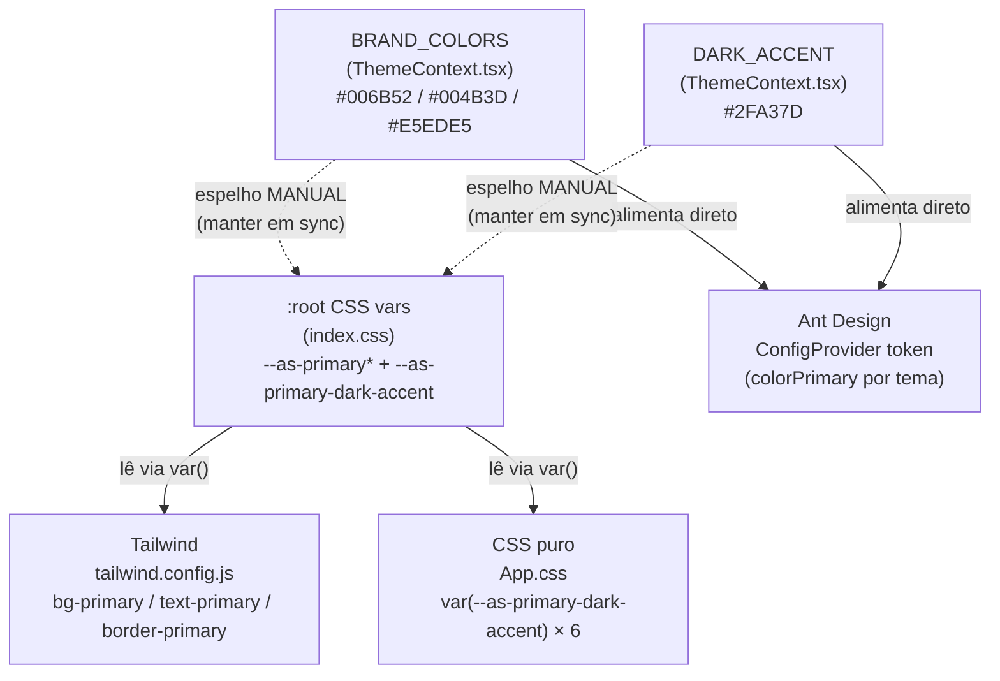

# Design System — Cores, Tema e Tokens (AS v2 Frontend)

Referência viva do sistema de cor e tema do frontend. Existe por um motivo prático:
a paleta da marca é **uma fonte de verdade espelhada em três consumidores** (Ant Design,
Tailwind, CSS puro). Sem este documento, mexer numa cor vira caça a `#hex` soltos, e as
regressões de acessibilidade voltam calmamente.

**Regra de ouro:** nenhum componente escreve `#hex` de marca direto. Consome sempre por
token (AntD `ConfigProvider`, classe Tailwind `*-primary`, ou `var(--as-*)`). Trocar uma cor
= editar **só** os pontos-fonte listados na [seção 6](#6-como-alterar-uma-cor-checklist).

Código-fonte: [`ThemeContext.tsx`](../frontend/src/contexts/ThemeContext.tsx) ·
[`index.css`](../frontend/src/index.css) ·
[`tailwind.config.js`](../frontend/tailwind.config.js) ·
[`App.css`](../frontend/src/App.css).

---

## 1. A cadeia SSOT (leia isto antes de mexer em qualquer cor)

A marca tem **um** ponto-fonte semântico (`BRAND_COLORS`) e **um** ponto-fonte de acesso via
CSS (`:root`). O resto **deriva** ou **espelha** — nunca é uma terceira cópia independente.



Duas relações são **espelho manual** (linhas pontilhadas) — o único ponto de fragilidade,
onde um edita-um-esquece-o-outro cria drift:

| Fonte (TS) | Espelho (CSS) | Consequência do drift |
|---|---|---|
| `BRAND_COLORS.primary/primaryDark/primaryLight` | `--as-primary / --as-primary-dark / --as-primary-light` | AntD e Tailwind/CSS mostram verdes diferentes |
| `DARK_ACCENT` (`#2FA37D`) | `--as-primary-dark-accent` | acento do tema escuro diverge entre inputs AntD e o CSS de `App.css` |

Tailwind e `App.css` **leem** as CSS vars — não têm hex próprio, então não podem driftar por
conta. O comentário em cada arquivo aponta para este contrato; ao editar, mantenha o comentário.

---

## 2. Paleta da marca

Fonte: `BRAND_COLORS` em [`ThemeContext.tsx`](../frontend/src/contexts/ThemeContext.tsx).
Espelhada nas `--as-*` de [`index.css`](../frontend/src/index.css).

| Papel | Hex | Token AntD / CSS var | Uso |
|---|---|---|---|
| Primária (marca) | `#006B52` | `colorPrimary` (light) · `--as-primary` | botões, links, seleção — tema claro |
| Primária escura | `#004B3D` | `--as-primary-dark` | hover/pressionado, sidebar collapse |
| Primária clara | `#E5EDE5` | `--as-primary-light` | fundos suaves, chips |
| Fundo de página | `#f0f2f5` | `pageBackground` | layout claro (dark → `#141414`) |
| Fundo de card | `#ffffff` | `cardBackground` | cards claros (dark → `#1f1f1f`) |
| Sidebar | `#006B52` | `sidebarBackground` | menu lateral (dark → `#141414`) |

**Status (tokens AntD, não são a marca):** sucesso `#52c41a` · aviso `#faad14` ·
erro `#ff4d4f` · info `#1890ff`, com fundos `successBg #f6ffed` / `warningBg #fffbe6` /
`errorBg #fff2f0`. O **vermelho de erro** é semanticamente reservado — ver seção 4.

---

## 3. Tema claro × escuro

Dois conjuntos de token AntD (`lightThemeTokens` / `darkThemeTokens`) trocados por
`isDark` no `antThemeConfig`. `borderRadius: 6` em ambos.

| Aspecto | Claro | Escuro |
|---|---|---|
| `colorPrimary` (acento de interação) | `#006B52` (marca) | `#2FA37D` (`DARK_ACCENT`) — ver seção 4 |
| Fundo container | `#ffffff` | `#1f1f1f` |
| Fundo layout | `#f0f2f5` | `#141414` |
| Fundo elevado | (default AntD) | `#262626` |
| Borda | (default AntD) | `#424242` / secundária `#303030` |
| Texto terciário | `rgba(0,0,0,.55)` (fix a11y ↓) | `rgba(255,255,255,.45)` |

**Fix de a11y no tema claro:** o default AntD para texto terciário é `rgba(0,0,0,.45)` ≈
`#8c8c8c`, que dá só **3.36:1** em branco (reprova o mínimo 4.5:1 de texto — SC 1.4.3),
visível nos labels do `Descriptions`. Escurecemos para `rgba(0,0,0,.55)` ≈ `#737373`
(**4.74:1**, passa). Mudança sutil, só aumenta contraste.

---

## 4. O acento do tema escuro — por que verde, não vermelho

Historicamente `darkThemeTokens.colorPrimary` era `#ea2a33` (vermelho). O AntD deriva desse
token **toda** a paleta de interação: hover, foco, ativo, item de menu selecionado, paginação,
borda de input focado. Ou seja, no tema escuro a interface inteira "acendia" em vermelho.

Isso é um **conflito semântico**, não uma falha de contraste. Medições (WCAG 2.x, luminância
relativa) sobre o container escuro `#1f1f1f`:

| Cor | Sobre `#1f1f1f` | Sobre `#141414` | Veredito |
|---|---|---|---|
| `#ea2a33` (vermelho antigo) | **3.83:1** | — | Contraste **passava** (≥3:1). O problema era só semântico. |
| `#006B52` (verde da marca, cru) | **2.53:1** | 2.26:1 | ❌ **Reprova** SC 1.4.11 (≥3:1). Por isso o swap ingênuo não serve. |
| `#2FA37D` (`DARK_ACCENT`, verde clareado) | **5.22:1** | **5.84:1** | ✅ Passa folgado — inclusive o mínimo de texto (4.5:1). |

O raciocínio, em três passos:

1. **Vermelho = perigo/erro.** Um acento de interação (hover/seleção/sucesso implícito) em
   vermelho colide com o significado universal do vermelho e com os tokens de status. Trocar
   por **verde da marca** alinha identidade + semântica.
2. **Verde da marca cru (`#006B52`) reprova WCAG no dark** (2.53:1 < 3:1). Escuro-sobre-escuro.
   Não dá para usar o mesmo hex do tema claro.
3. **Solução:** o **mesmo verde clareado**, `#2FA37D` (5.22:1). Mantém a identidade da marca,
   passa o contraste com folga, e libera o vermelho para significar **só erro/danger**.

`DARK_ACCENT` também pinta `Menu.darkItemSelectedBg` no tema escuro, e é espelhado em
`--as-primary-dark-accent`, consumido por [`App.css`](../frontend/src/App.css) em **6 pontos**
(borda/cor de inputs, botões e paginação em `.dark`).

> **Não faça** o swap ingênuo `#ea2a33 → #006B52` "para usar a cor da marca": reintroduz a
> falha de contraste que o vermelho não tinha. Se precisar de outro verde, **meça** primeiro
> (seção 7) e mantenha ≥ 3:1 sobre `#1f1f1f` **e** `#141414`.

---

## 5. Como consumir as cores (nunca hardcode)

| Camada | Como | Exemplo |
|---|---|---|
| Componentes AntD | Herdado do `ConfigProvider` (token por tema) | `<Button type="primary">` já sai na cor certa |
| Estilos utilitários | Classe Tailwind lendo a CSS var | `className="bg-primary text-white"` |
| CSS puro / overrides | `var(--as-*)` | `border-color: var(--as-primary-dark-accent)` |

Tailwind expõe **apenas** `primary` (+ `.dark`/`.light`) — ver `theme.extend.colors` em
[`tailwind.config.js`](../frontend/tailwind.config.js). Precisa de outra cor de marca como
utilitário? Adicione o token lá lendo uma CSS var nova; não invente hex no componente.

Precisa da paleta em JS/TS (ex.: cor de série de gráfico)? Use o hook `useBrandColors()`
(retorna `BRAND_COLORS` com overrides de fundo por tema) em vez de importar hex.

---

## 6. Como alterar uma cor (checklist)

**Trocar o verde da marca** (afeta claro + AntD + Tailwind + CSS):

1. `BRAND_COLORS.primary/primaryDark/primaryLight` em `ThemeContext.tsx`.
2. `lightThemeTokens.colorPrimary` (se mudou a primária).
3. As 3 linhas `--as-primary* ` em `:root` de `index.css` (o espelho manual).
4. Rode a verificação de contraste sobre `#ffffff` (texto ≥ 4.5:1, UI ≥ 3:1).

**Trocar o acento do tema escuro:**

1. `DARK_ACCENT` em `ThemeContext.tsx` (pinta `colorPrimary` dark + `Menu.darkItemSelectedBg`).
2. `--as-primary-dark-accent` em `:root` de `index.css` (espelho de `App.css`).
3. Verifique ≥ 3:1 sobre `#1f1f1f` **e** `#141414`.

**Nunca:** escrever `#hex` de marca dentro de um `.tsx`/`.css` de componente. Se aparecer um
hex novo num diff de componente, é sinal de que faltou passar por token.

---

## 7. Verificação de contraste (WCAG)

Limiares que este design system respeita (WCAG 2.1 AA):

- **Texto normal** (SC 1.4.3): ≥ **4.5:1**.
- **Componentes de UI / estados** (SC 1.4.11): ≥ **3:1** (borda de input, ícones, acento).

Fórmula: luminância relativa de cada cor, `contraste = (L_claro + 0.05) / (L_escuro + 0.05)`.
Para checar um par antes de commitar, um script pontual (Node) resolve — mesma fórmula usada
para validar `#2FA37D`:

```js
const lin = c => { c/=255; return c<=0.03928 ? c/12.92 : Math.pow((c+0.055)/1.055,2.4); };
const L = h => { h=h.replace('#',''); const [r,g,b]=[0,2,4].map(i=>parseInt(h.slice(i,i+2),16));
  return 0.2126*lin(r)+0.7152*lin(g)+0.0722*lin(b); };
const ratio = (a,b) => { const x=L(a),y=L(b); return (Math.max(x,y)+0.05)/(Math.min(x,y)+0.05); };
console.log(ratio('#2FA37D', '#1f1f1f').toFixed(2)); // 5.22
```

Sempre meça o acento do tema escuro contra **os dois** fundos (`#1f1f1f` container e `#141414`
layout) — passar em um e reprovar no outro é o erro clássico.

---

## Histórico

- **2026-08-25** — Documento criado. Consolida o contrato de cor/tema que estava só em
  comentários de código. Registra o racional WCAG do `DARK_ACCENT` (`#ea2a33` → `#2FA37D`,
  PR #1846) e a cadeia SSOT de três consumidores.
