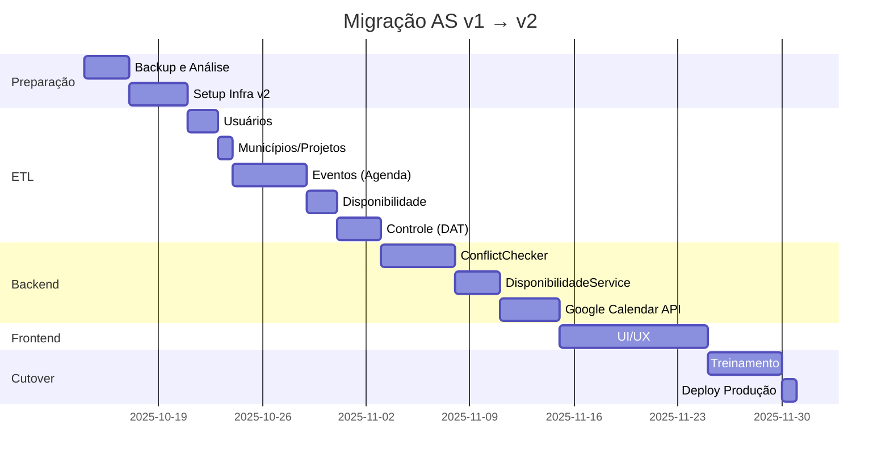

# 🔄 Migration Plan — v1 (Planilhas) → v2 (AS)

**Data**: 2025-10-10
**Status**: 🚧 Planejamento
**Prazo estimado**: 10 semanas (2 sprints de 2 semanas cada)

---

## 🎯 Objetivo

Migrar completamente do sistema baseado em planilhas Excel/Google Sheets para o **Aprender Sistema v2 (AS v2)**, eliminando as **82.389 fórmulas** identificadas e estabelecendo o PostgreSQL como **Single Source of Truth**.

---

## 📊 Análise de Impacto

### Sistemas Afetados

| Sistema Atual | Impacto | Plano de Contingência |
|---------------|---------|----------------------|
| **4 planilhas Excel** (7.73 MB) | 🔴 ALTO — Será substituído | Backup completo + modo somente-leitura |
| **IMPORTRANGE** (referências externas) | 🔴 ALTO — Será eliminado | Migração para FKs Django |
| **Google Calendar** (integração manual) | 🟡 MÉDIO — Mantém, mas automatiza | Fallback manual se API falhar |
| **Email** (notificações manuais) | 🟢 BAIXO — Automatiza | N/A |

### Usuários Impactados

| Perfil | Quantidade | Treinamento Necessário | Período de Adaptação |
|--------|------------|------------------------|----------------------|
| **Superintendência** | 2 | ✅ Alta (aprovações) | 2 semanas |
| **Coordenadores** | 8 | ✅ Média (solicitações) | 1 semana |
| **Formadores** | 88 | ✅ Baixa (bloqueios) | 3 dias |
| **DAT (Controle)** | 3 | ✅ Alta (métricas) | 2 semanas |

### Dados a Migrar

| Origem | Registros Estimados | Complexidade | Estratégia |
|--------|---------------------|--------------|-----------|
| **Usuários.xlsx** | 139 usuários | 🟢 BAIXA | ETL direto |
| **Agenda 2025.xlsx** (9 abas) | 2.242 eventos | 🟡 MÉDIA | ETL + validação |
| **Disponibilidade 2025.xlsx** | 450 bloqueios | 🟢 BAIXA | ETL direto |
| **Controle 2025.xlsx** (7 abas) | 1.200 registros | 🔴 ALTA | ETL + reconciliação |
| **Google Calendar** | 1.500 eventos | 🟡 MÉDIA | Sync bidirecional |

---

## 🗺️ Fases da Migração

### 📅 Cronograma Geral



---

## 📦 Fase 1: Preparação (Semana 1)

### 1.1 Backup Completo das Planilhas

**Objetivo**: Garantir que dados não sejam perdidos durante a migração.

**Tarefas**:
- [ ] **1.1.1** Exportar todas as 4 planilhas em formato `.xlsx` (local)
- [ ] **1.1.2** Criar cópias de segurança no Google Drive (pasta dedicada)
- [ ] **1.1.3** Fazer dump do Google Calendar (via API)
- [ ] **1.1.4** Documentar estrutura de cada aba (schemas, fórmulas-chave)

**Entregável**: `backups/2025-10-10/` com:
- `Agenda_2025_backup.xlsx`
- `Disponibilidade_2025_backup.xlsx`
- `Controle_2025_backup.xlsx`
- `Usuarios_backup.xlsx`
- `google_calendar_dump.json`

**Comando**:
```bash
# Via Docker
docker compose exec -T web python manage.py backup_planilhas \
    --source /app/data/csv-import/ \
    --output /app/backups/2025-10-10/
```

### 1.2 Setup Infraestrutura v2

**Objetivo**: Preparar ambiente v2 (staging) paralelo ao v1.

**Tarefas**:
- [ ] **1.2.1** Provisionar servidor staging (Render/AWS/GCP)
- [ ] **1.2.2** Configurar PostgreSQL 15 (RDS/Cloud SQL)
- [ ] **1.2.3** Configurar Redis 7 (cache/Celery)
- [ ] **1.2.4** Deploy Docker containers (web, worker, beat)
- [ ] **1.2.5** Configurar SSL (Let's Encrypt)
- [ ] **1.2.6** Configurar monitoramento (Sentry, logs)

**Entregável**: URL `https://staging.aprender.com.br` funcional

**Validação**:
```bash
curl -I https://staging.aprender.com.br/api/health/
# Esperado: HTTP 200 OK
```

### 1.3 Validação dos Scripts de ETL

**Objetivo**: Testar scripts de migração em ambiente isolado (dry-run).

**Tarefas**:
- [ ] **1.3.1** Rodar ETL em modo simulação (`--dry-run`)
- [ ] **1.3.2** Validar integridade referencial (todos os FKs resolvidos)
- [ ] **1.3.3** Identificar dados órfãos/inconsistentes
- [ ] **1.3.4** Gerar relatório de validação

**Comando**:
```bash
docker compose exec -T web python manage.py etl_completo \
    --dry-run \
    --verbose \
    --output /app/out_etl/dry_run_report.md
```

**Entregável**: `out_etl/dry_run_report.md` com:
- Total de registros por tabela
- Erros de validação (se houver)
- Warnings (dados inconsistentes)
- Tempo estimado de execução real

---

## 🔄 Fase 2: ETL & Data Migration (Semana 2-3)

### 2.1 Migração de Usuários

**Prioridade**: 🔴 CRÍTICA (base de todas as FKs)

**Fonte**: `Usuários.xlsx`
**Destino**: `core_usuario`, `core_formador`

**Schema Mapping**:
| Coluna Excel | Campo Django | Transformação |
|--------------|--------------|---------------|
| Nome | usuario.nome | Trim, Title case |
| Email | usuario.email | Lower, validate_email |
| CPF | usuario.cpf | Format XXX.XXX.XXX-XX |
| Cargo | usuario.perfil | Map cargo→perfil |
| Área | formador.area_atuacao | Se cargo=Formador |

**Comando**:
```bash
docker compose exec -T web python manage.py etl_usuarios \
    --source /app/data/csv-import/Usuarios.xlsx \
    --sheet "Planilha1" \
    --create-missing \
    --verbose
```

**Validação**:
```sql
-- Esperado: 139 usuários, 88 formadores
SELECT COUNT(*) FROM core_usuario;          -- 139
SELECT COUNT(*) FROM core_formador;         -- 88
SELECT COUNT(*) FROM core_formador f
JOIN core_usuario u ON f.usuario_id = u.id;  -- 88 (integridade OK)
```

**Rollback** (se necessário):
```bash
docker compose exec -T web python manage.py flush_usuarios --confirm
```

### 2.2 Migração de Dados Mestres

**Prioridade**: 🟡 ALTA (pré-requisito para eventos)

**Fontes**:
- `Controle 2025.xlsx` → Municípios
- `Controle 2025.xlsx` → Projetos
- `Agenda 2025.xlsx` → Tipos de Evento

**Destinos**:
- `core_municipio`
- `core_projeto`
- `core_tipo_evento`

**Comando**:
```bash
docker compose exec -T web python manage.py etl_dados_mestres \
    --source /app/data/csv-import/ \
    --create-missing \
    --verbose
```

**Validação**:
```sql
SELECT COUNT(*) FROM core_municipio;    -- Esperado: 74
SELECT COUNT(*) FROM core_projeto;      -- Esperado: 24
SELECT COUNT(*) FROM core_tipo_evento;  -- Esperado: 20
```

### 2.3 Migração de Eventos (Agenda)

**Prioridade**: 🔴 CRÍTICA (core do sistema)

**Fonte**: `Acompanhamento de Agenda _ 2025.xlsx` (9 abas)
**Destino**: `core_solicitacao` + `core_solicitacao_formadores` (M2M)

**Abas a processar** (ordem de prioridade):
1. **Super** (1.982 eventos) — Aprovações da superintendência
2. **ACerta** (1.001 eventos)
3. **Outros** (2.044 eventos)
4. **Vidas** (998 eventos)
5. **Brincando** (1.000 eventos)
6. **DISPONIBILIDADE** (2.132 registros)
7. **DESLOCAMENTO** (995 registros)
8. **Pré-Agenda** (7.657 eventos) — Rascunhos (status=PENDENTE)
9. **Configurações** (919 fórmulas) — Ignorar (apenas lógica)

**Schema Mapping**:
| Coluna Excel | Campo Django | Transformação |
|--------------|--------------|---------------|
| Data | solicitacao.data | Parse DD/MM/YYYY |
| Hora Início | solicitacao.hora_inicio | Parse HH:MM |
| Hora Fim | solicitacao.hora_fim | Parse HH:MM |
| Município | solicitacao.municipio_id | Lookup core_municipio |
| Projeto | solicitacao.projeto_id | Lookup core_projeto |
| Tipo | solicitacao.tipo_evento_id | Lookup core_tipo_evento |
| Formadores (colunas N-S) | M2M solicitacao_formadores | Split, lookup core_formador |
| Status | solicitacao.status | Map sheet→status |

**Comando**:
```bash
# Processar todas as abas sequencialmente
for aba in Super ACerta Outros Vidas Brincando; do
    docker compose exec -T web python manage.py etl_agenda \
        --source /app/data/csv-import/Agenda_2025.xlsx \
        --sheet "$aba" \
        --status APROVADO \
        --verbose
done

# Pré-Agenda como rascunhos
docker compose exec -T web python manage.py etl_agenda \
    --source /app/data/csv-import/Agenda_2025.xlsx \
    --sheet "Pré-Agenda" \
    --status PENDENTE \
    --verbose
```

**Validação**:
```sql
-- Esperado: 2.242 solicitações (excluindo Pré-Agenda que são rascunhos)
SELECT COUNT(*) FROM core_solicitacao WHERE status='APROVADO';  -- 2.242

-- Validar M2M (cada evento tem 1+ formadores)
SELECT
    s.id,
    COUNT(sf.formador_id) AS num_formadores
FROM core_solicitacao s
LEFT JOIN core_solicitacao_formadores sf ON s.id = sf.solicitacao_id
GROUP BY s.id
HAVING COUNT(sf.formador_id) = 0;  -- Esperado: 0 (nenhum evento sem formador)

-- Validar integridade referencial
SELECT COUNT(*) FROM core_solicitacao WHERE municipio_id IS NULL;  -- Esperado: 0
SELECT COUNT(*) FROM core_solicitacao WHERE projeto_id IS NULL;    -- Esperado: 0
```

### 2.4 Migração de Disponibilidade

**Prioridade**: 🟡 ALTA (necessária para conflitos)

**Fonte**: `Disponibilidade _ 2025.xlsx`
**Destino**: `core_disponibilidade_formador`, `core_deslocamento`

**Comando**:
```bash
# Bloqueios (P/T)
docker compose exec -T web python manage.py etl_disponibilidade \
    --source /app/data/csv-import/Disponibilidade_2025.xlsx \
    --sheet "MENSAL" \
    --verbose

# Deslocamentos (D)
docker compose exec -T web python manage.py etl_deslocamentos \
    --source /app/data/csv-import/Disponibilidade_2025.xlsx \
    --sheet "DESLOCAMENTO" \
    --verbose
```

**Validação**:
```sql
SELECT COUNT(*) FROM core_disponibilidade_formador;  -- Esperado: ~450
SELECT COUNT(*) FROM core_deslocamento;              -- Esperado: ~995
```

### 2.5 Migração de Controle (DAT)

**Prioridade**: 🟢 MÉDIA (métricas, não crítico para operação)

**Fonte**: `Planilha de Controle - 2025.xlsx`
**Destino**: Tabelas específicas de controle (se necessário) ou Materialized Views

**Observação**: Muitos dados de Controle são **agregações** (SUMPRODUCT, etc.) que serão **recalculadas** via MVs no AS v2. ETL apenas para dados não-derivados.

**Comando**:
```bash
docker compose exec -T web python manage.py etl_controle \
    --source /app/data/csv-import/Controle_2025.xlsx \
    --sheet "☑️ CADASTROS" \
    --verbose
```

---

## 🔧 Fase 3: Backend Services (Semana 4-5)

### 3.1 Implementar ConflictChecker

**Objetivo**: Substituir as 22.291 fórmulas da aba CONFIG.

**Arquivo**: `v2/backend/apps/core/services/conflict_checker.py`

**Testes obrigatórios**:
```python
# tests/test_conflict_checker.py
def test_overlap_total():
    # Evento A: 08:00-10:00
    # Evento B: 09:00-11:00 → CONFLITO
    assert ConflictChecker().check(...) == ['SOBREPOSIÇÃO']

def test_overlap_partial():
    # Evento A: 08:00-10:00
    # Evento B: 10:00-12:00 → SEM CONFLITO (borda)
    assert ConflictChecker().check(...) == []

def test_bloqueio_total_impede_evento():
    # Bloqueio T: 01/01-31/01
    # Evento: 15/01 → CONFLITO
    assert ConflictChecker().check(...) == ['BLOQUEIO_TOTAL']

# Total: 15 testes (conforme TESTS_PLAN.md)
```

**Métrica de sucesso**: 100% cobertura, todos os testes passando.

### 3.2 Implementar DisponibilidadeService

**Objetivo**: Gerar mapa mensal (códigos D/P/T/E/M/X) dinamicamente.

**Arquivo**: `v2/backend/apps/core/services/disponibilidade_service.py`

**API Endpoint**:
```python
# GET /api/disponibilidade/?formador_id=1&ano=2025&mes=10
{
  "formador": {"id": 1, "nome": "João Silva"},
  "mes": "2025-10",
  "dias": [
    {"dia": 1, "codigo": "E", "descricao": "1 evento confirmado"},
    {"dia": 2, "codigo": "M", "descricao": "2 eventos no mesmo dia"},
    {"dia": 3, "codigo": null, "descricao": "Disponível"},
    {"dia": 15, "codigo": "T", "descricao": "Bloqueio total"},
    // ...
  ]
}
```

**Testes**:
```python
def test_codigo_E_evento_unico():
    # 1 evento aprovado no dia 01/10 → E
    assert service.check_day(formador, date(2025, 10, 1)) == 'E'

def test_codigo_M_multiplos_eventos():
    # 2 eventos aprovados no dia 02/10 → M
    assert service.check_day(formador, date(2025, 10, 2)) == 'M'
```

### 3.3 Integração Google Calendar

**Objetivo**: Criar evento automaticamente após aprovação.

**Arquivo**: `v2/backend/services/integrations/google_calendar.py`

**Fluxo**:
1. Solicitação aprovada → Sinal Django `post_save`
2. Celery task `create_google_event.delay(solicitacao_id)`
3. Google Calendar API: `events().insert(...)`
4. Salvar `google_calendar_id` e `meet_link` em `Evento`

**Testes**:
```python
@mock.patch('googleapiclient.discovery.build')
def test_create_event_success(mock_gcal):
    mock_gcal.return_value.events().insert().execute.return_value = {
        'id': 'gcal123',
        'hangoutLink': 'https://meet.google.com/abc-xyz'
    }

    evento = create_google_event(solicitacao.id)
    assert evento.google_calendar_id == 'gcal123'
    assert 'meet.google.com' in evento.meet_link
```

---

## 🎨 Fase 4: Frontend (Semana 6-7)

### 4.1 Formulário de Solicitação

**Template**: `v2/backend/apps/core/templates/core/solicitacao_form.html`

**Features**:
- Autocomplete de formadores (Select2 ou Choices.js)
- Validação assíncrona de disponibilidade (fetch API)
- Mensagens de erro claras (ISO 9241-110)

**Teste E2E** (Playwright):
```python
def test_solicitar_evento_sem_conflito(page):
    page.goto('http://localhost:8000/solicitar/')
    page.fill('#id_data', '15/10/2025')
    page.select_option('#id_formador', label='João Silva')
    page.click('button[type="submit"]')

    # Esperado: sucesso
    assert 'Solicitação criada com sucesso' in page.content()
```

### 4.2 Mapa de Disponibilidade

**Template**: `v2/backend/apps/core/templates/core/disponibilidade_mapa.html`

**Features**:
- Grade mensal colorida (D/P/T/E/M/X)
- Tooltips com detalhes dos eventos (Bootstrap Popovers)
- Filtros por formador/projeto

**Teste E2E**:
```python
def test_mapa_disponibilidade_carrega(page):
    page.goto('http://localhost:8000/disponibilidade/')
    page.select_option('#formador_select', label='João Silva')

    # Esperado: calendário renderizado
    assert page.locator('.calendar-day').count() == 31  # Outubro tem 31 dias
```

---

## ✅ Fase 5: Testes & QA (Semana 8)

### 5.1 Testes de Regressão

**Objetivo**: Garantir que v2 mantém funcionalidades do v1.

**Cenários críticos**:
- [ ] Criar solicitação sem conflito → Status PENDENTE
- [ ] Criar solicitação com conflito → ValidationError
- [ ] Aprovar solicitação → Evento criado no Google Calendar
- [ ] Bloquear disponibilidade (P/T) → Impede novas solicitações
- [ ] Visualizar mapa mensal → Cores corretas (D/P/T/E/M/X)

**Comando**:
```bash
docker compose exec -T web pytest tests/ --cov=core --cov-report=html
# Meta: 90%+ cobertura
```

### 5.2 Testes de Performance

**Objetivo**: Garantir que v2 é mais rápido que v1 (planilhas).

**Benchmarks**:
| Operação | v1 (Planilhas) | Meta v2 | Medido v2 |
|----------|----------------|---------|-----------|
| Criar solicitação | 5-10 min | < 2 min | _TBD_ |
| Validar conflitos | 3-5s (SUMPRODUCT) | < 500ms | _TBD_ |
| Carregar mapa mensal | 10-15s (IMPORTRANGE) | < 1s | _TBD_ |

**Ferramenta**: Locust (load testing)
```python
# locustfile.py
class UserBehavior(TaskSet):
    @task(1)
    def create_solicitacao(self):
        self.client.post('/solicitar/', {
            'data': '15/10/2025',
            'formador': 1,
            # ...
        })
```

### 5.3 Testes de Segurança

**Objetivo**: Garantir que v2 está protegido contra vulnerabilidades.

**Checklist**:
- [ ] SQL Injection (Django ORM protege nativamente)
- [ ] XSS (templates escapam automaticamente)
- [ ] CSRF (token obrigatório em forms)
- [ ] Permissions (RBAC testado)
- [ ] Secrets (variáveis de ambiente, nunca hardcoded)

**Ferramenta**: Bandit + Django's security middleware
```bash
docker compose exec -T web bandit -r backend/ -ll
# Esperado: 0 issues de severidade alta
```

---

## 🚀 Fase 6: Cutover & Go-Live (Semana 9-10)

### 6.1 Treinamento da Equipe

**Objetivo**: Preparar usuários para o novo sistema.

**Formato**: Hands-on sessions (1h cada)

| Perfil | Sessão | Tópicos | Data |
|--------|--------|---------|------|
| **Superintendência** | 2h | Aprovações, dashboard, métricas | Semana 9 |
| **Coordenadores** | 1.5h | Criar solicitações, verificar conflitos | Semana 9 |
| **Formadores** | 1h | Bloquear disponibilidade, visualizar agenda | Semana 9 |
| **DAT (Controle)** | 2h | Relatórios, exportação, integrações | Semana 9 |

**Entregável**: Vídeos gravados + manual em PDF.

### 6.2 Deploy em Produção

**Data**: Sexta-feira, Semana 10 (pós-expediente)

**Checklist**:
- [ ] Backup final das planilhas (freeze mode)
- [ ] Deploy v2 em produção (`git push production main`)
- [ ] Rodar migrations (`python manage.py migrate`)
- [ ] Rodar ETL completo (`python manage.py etl_completo`)
- [ ] Validar integridade (`python manage.py check_data_integrity`)
- [ ] Smoke tests (criar 1 solicitação, aprovar, verificar Google Calendar)
- [ ] Monitoramento ativo (Sentry, logs, métricas)

**Comunicação**:
```
Assunto: Sistema Aprender v2 — Agora no Ar! 🚀

Prezados,

A partir de hoje (DD/MM/YYYY), o Sistema Aprender v2 está oficialmente no ar!

🔗 Novo acesso: https://aprender.com.br
📚 Manual: https://aprender.com.br/manual
🎥 Vídeos: https://aprender.com.br/tutoriais

⚠️ IMPORTANTE: As planilhas antigas estão agora em modo somente-leitura.
Todas as solicitações devem ser feitas pelo novo sistema.

Suporte: suporte@aprender.com.br | WhatsApp: (85) 99999-9999

Equipe Aprender
```

### 6.3 Suporte Pós-Deploy

**Duração**: 2 semanas (período crítico)

**Canais**:
- 📧 Email: suporte@aprender.com.br (SLA: 4h)
- 📞 WhatsApp: Grupo dedicado
- 🎫 Tickets: Sistema de chamados interno

**On-call**: Desenvolvedor disponível 24/7 na primeira semana.

---

## 🔄 Rollback Plan (Contingência)

### Cenário: v2 tem bug crítico pós-deploy

**Decisão**: Rollback para planilhas (temporário)

**Passos**:
1. **Comunicar equipe** (email/WhatsApp)
2. **Restaurar acesso** às planilhas (remover read-only)
3. **Pausar v2** (manter no ar, mas não usar)
4. **Fix bug** em staging
5. **Re-deploy** após validação
6. **Re-cutover** (com mais cautela)

**Critérios para rollback**:
- [ ] Perda de dados (solicitações não salvas)
- [ ] Indisponibilidade > 4h
- [ ] Bug que impede aprovações
- [ ] Falha de integração Google Calendar (crítico)

**Observação**: Rollback deve ser **última opção** — preferir fix forward.

---

## 📊 Métricas de Sucesso

| Métrica | Baseline (v1) | Meta v2 | Como Medir |
|---------|---------------|---------|------------|
| **Tempo médio de solicitação** | 5-10 min | < 2 min | Google Analytics + logs |
| **Taxa de conflitos detectados** | ~15% (manual) | > 95% (automático) | ConflictChecker logs |
| **Uptime** | 95% (depende GSheets) | > 99.5% | Sentry/APM |
| **Satisfação do usuário** | N/A | > 4/5 | Survey pós-treinamento |
| **Bugs críticos pós-deploy** | N/A | < 3 | Issue tracker |

---

## 📚 Anexos

### A. Comandos Úteis

```bash
# Status do ETL
docker compose exec -T web python manage.py etl_status

# Validar integridade
docker compose exec -T web python manage.py check_data_integrity

# Reconciliar com Google Calendar
docker compose exec -T web python manage.py sync_google_calendar --dry-run

# Gerar relatório de migração
docker compose exec -T web python manage.py migration_report --output /app/reports/
```

### B. Contatos de Emergência

| Papel | Nome | Contato |
|-------|------|---------|
| **Tech Lead** | _TBD_ | email@aprender.com.br |
| **DevOps** | _TBD_ | devops@aprender.com.br |
| **Product Owner** | _TBD_ | po@aprender.com.br |

---

**Próximos Passos**: Executar Fase 1 (Preparação) → Criar backups e setup staging.
