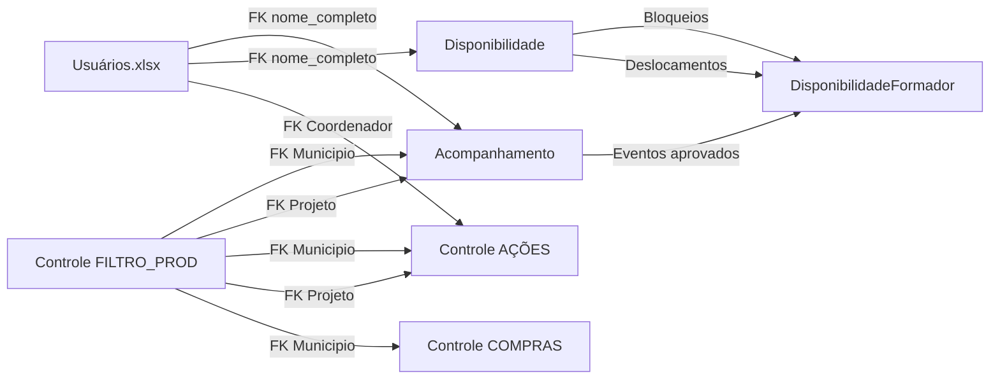

# Relatório de Análise: Planilhas Google Sheets do Aprender Sistema

**Data da Análise**: 2025-10-22
**Objetivo**: Documentar estrutura, regras de negócio e requisitos de ETL para as 4 planilhas principais do sistema

---

## 1. Planilha: Acompanhamento de Agenda 2025

### 1.1 Aba: ACerta (~100-200 eventos)

**Colunas (A-T)**:

| Coluna | Nome | Tipo | Exemplo | Observações |
|--------|------|------|---------|-------------|
| A | Criado na Agenda | Texto | "SIM", "NÃO" | Indica se evento foi lançado no Google Calendar |
| B | (vazia) | - | - | Espaçamento visual |
| C | (vazia) | - | - | Espaçamento visual |
| D | C ancelar | Texto | "x", "remarcado", "" | "x" ou "remarcado" = evento cancelado |
| E | município | Texto | "SOBRAL - CE" | FK para Municipio (nome - UF) |
| F | encontro | Texto | "1.0", "2.0", "3.0" | Número sequencial do encontro |
| G | tipo | Texto | "Presencial", "Remoto" | Modalidade do evento |
| H | data | Data | 2025-01-15 | Data do evento |
| I | hora início | Hora | 08:00 | Horário de início |
| J | hora fim | Hora | 12:00 | Horário de término |
| K | projeto | Texto | "ACERTA MATEMÁTICA" | FK para Projeto |
| L | segmento | Texto | "Fundamental I" | Público-alvo |
| M | Coord Acompanha | Booleano | TRUE, FALSE | Se coordenador acompanha o evento |
| N | Coordenador | Texto | "Nome Completo" | FK para Usuario (coordenador) |
| O | Formador 1 | Texto | "Nome Completo" | FK para Usuario (formador) |
| P | Formador 2 | Texto | "Nome Completo" | FK para Usuario (formador) |
| Q | Formador 3 | Texto | "Nome Completo" | FK para Usuario (formador) |
| R | Formador 4 | Texto | "Nome Completo" | FK para Usuario (formador) |
| S | Formador 5 | Texto | "Nome Completo" | FK para Usuario (formador) |
| T | Convidados | Texto | "Nome 1, Nome 2" | Lista de convidados externos |

**Regras Semânticas**:
- Coluna D: Se contém "x" ou "remarcado" → `status = 'cancelado'`
- Colunas O-S: Até 5 formadores por evento (M2M com Participation)
- Coluna M: Define se `coordenador_acompanha = True`
- Vazio em O-S: Evento sem formadores atribuídos (status pendente)

**Relacionamentos**:
- E → `Municipio.nome + " - " + Municipio.uf`
- K → `Projeto.nome`
- N → `Usuario.nome_completo` (cargo = Coordenador)
- O-S → `Usuario.nome_completo` (cargo = Formadores)

**Tratamentos Necessários**:
1. Juntar colunas H + I e H + J para criar `DateTimeField` (timezone America/Fortaleza)
2. Normalizar município: separar nome e UF
3. Validar existência de FK antes de criar Solicitacao
4. Criar registros `Participation` para cada Formador 1-5 não vazio

**Alertas**:
- ⚠️ Município pode não existir em `Municipio` (referência cruzada com Planilha de Controle)
- ⚠️ Formadores podem ter nomes ligeiramente diferentes entre planilhas
- ⚠️ Eventos sem formadores (colunas O-S vazias) devem ficar em `status = 'pendente'`

---

### 1.2 Aba: Outros (~50-100 eventos)

**Estrutura**: Idêntica à aba ACerta (colunas A-T)

**Regra Especial**:
- Se `projeto` contém "IDEB" ou "IDEB10" → mapear para projeto normalizado "Gestão Escolar"

**Diferença**: Eventos de outros projetos que não são ACerta, Brincando ou Vidas

---

### 1.3 Aba: Super (~100-200 eventos)

**Estrutura**: Similar à ACerta, mas com coluna adicional:

| Coluna | Nome | Tipo | Exemplo | Observações |
|--------|------|------|---------|-------------|
| B | Aprovação | Texto | "APROVADO", "REPROVADO", "" | Status de aprovação pela Superintendência |

**Regras Semânticas**:
- Eventos nesta aba seguem fluxo SUPER (Projeto com `fluxo = 'SUPER'`)
- Coluna B vazia → `status = 'pendente'`
- Coluna B = "APROVADO" → `status = 'aprovado'`
- Coluna B = "REPROVADO" → `status = 'cancelado'`

**Workflow**:
1. Solicitação criada → aba Super, coluna B vazia
2. Superintendência analisa → preenche coluna B
3. Se aprovado → cria evento no Google Calendar (coluna A = "SIM")

**Alertas**:
- ✅ Esta aba implementa PA-01 a PA-07 (Política de Aprovação Manual)
- ⚠️ Coluna B pode conter variações ("Aprovado", "APROVADO", "aprovado")

---

### 1.4 Aba: Brincando (~30-50 eventos)

**Estrutura**: Idêntica à aba ACerta (colunas A-T)

**Observações**:
- Projeto específico: "BRINCANDO E APRENDENDO"
- Mesmo tratamento que ACerta

---

### 1.5 Aba: Vidas (~30-50 eventos)

**Estrutura**: Idêntica à aba ACerta (colunas A-T)

**Observações**:
- Projeto específico: "VIDAS SECAS"
- Mesmo tratamento que ACerta

---

## 2. Planilha: Disponibilidade 2025

**STATUS GERAL**: ⚠️ **EM MANUTENÇÃO** (aviso na aba MENSAL)

### 2.1 Aba: MENSAL

**Tipo**: ❌ **NÃO EXTRAIR** (view calculada)

**Descrição**: Grid visual de disponibilidade mensal com fórmulas complexas

**Estrutura**:
- Linhas: Formadores
- Colunas: Dias do mês (1-31)
- Células: Códigos de status (E, M, D, P, T, X)

**Códigos**:
- **E**: Evento confirmado
- **M**: Mais de um evento no dia
- **D**: Deslocamento
- **P**: Bloqueio parcial
- **T**: Bloqueio total
- **X**: Conflito detectado

**Fonte dos Dados**: Fórmulas IMPORTRANGE + QUERY que agregam:
- Aba DESLOCAMENTO (desta planilha)
- Aba Bloqueios (desta planilha)
- Acompanhamento de Agenda (planilha externa)

**Observações ETL**:
- Ignorar esta aba na extração
- Recriar lógica no backend via `DisponibilidadeFormador` + business rules RD-01 a RD-08

---

### 2.2 Aba: ANUAL

**Tipo**: ❌ **NÃO EXTRAIR** (view calculada)

**Descrição**: Agregação anual da disponibilidade por formador

**Estrutura**:
- Linhas: Formadores
- Colunas: Meses (Jan-Dez)
- Células: Contadores de eventos/bloqueios

**Observações ETL**:
- Ignorar na extração
- Dados fonte vêm de DESLOCAMENTO + Bloqueios + Acompanhamento

---

### 2.3 Aba: DESLOCAMENTO (~50-100 registros)

**Tipo**: ✅ **EXTRAIR** (fonte de dados)

**Colunas**:

| Coluna | Nome | Tipo | Exemplo | Observações |
|--------|------|------|---------|-------------|
| A | Formador | Texto | "Nome Completo" | FK para Usuario |
| B | Origem | Texto | "FORTALEZA - CE" | FK para Municipio |
| C | Destino | Texto | "SOBRAL - CE" | FK para Municipio |
| D | Data Saída | Data | 2025-01-15 | Data do deslocamento |
| E | Hora Saída | Hora | 06:00 | Horário de partida |
| F | Data Chegada | Data | 2025-01-15 | Data de chegada |
| G | Hora Chegada | Hora | 09:30 | Horário de chegada |
| H | Duração (min) | Inteiro | 210 | Calculado ou manual |
| I | Meio de Transporte | Texto | "Carro", "Avião" | Tipo de deslocamento |
| J | Observações | Texto | "Feriado prolongado" | Notas livres |

**Regras Semânticas**:
- Implementa **RD-04**: Buffer de deslocamento entre municípios distintos
- Duração típica: 60-120 minutos entre cidades
- Mesmo município (origem = destino): buffer = 0

**Relacionamentos**:
- A → `Usuario.nome_completo`
- B, C → `Municipio.nome + " - " + Municipio.uf`

**Modelo Django Necessário**:
```python
class Deslocamento(models.Model):
    formador = ForeignKey(Usuario, on_delete=CASCADE)
    origem = ForeignKey(Municipio, related_name='deslocamentos_origem')
    destino = ForeignKey(Municipio, related_name='deslocamentos_destino')
    saida = DateTimeField()  # D + E
    chegada = DateTimeField()  # F + G
    duracao_minutos = IntegerField()
    meio_transporte = CharField(max_length=50)
    observacoes = TextField(blank=True)
```

**Alertas**:
- ⚠️ Município em B ou C pode não existir (validar FK)
- ⚠️ Durações inconsistentes (chegada < saída)

---

### 2.4 Aba: Bloqueios (~30-50 registros)

**Tipo**: ✅ **EXTRAIR** (fonte de dados)

**Colunas**:

| Coluna | Nome | Tipo | Exemplo | Observações |
|--------|------|------|---------|-------------|
| A | Formador | Texto | "Nome Completo" | FK para Usuario |
| B | Tipo | Texto | "T", "P" | T=Total, P=Parcial |
| C | Data Início | Data | 2025-01-10 | Início do bloqueio |
| D | Hora Início | Hora | 08:00 | (somente para P) |
| E | Data Fim | Data | 2025-01-12 | Fim do bloqueio |
| F | Hora Fim | Hora | 17:00 | (somente para P) |
| G | Motivo | Texto | "Férias", "Licença médica" | Justificativa |

**Regras Semânticas**:
- **Tipo T (Total)**: Bloqueia o dia inteiro (ignorar colunas D e F)
- **Tipo P (Parcial)**: Bloqueia apenas o intervalo D-F
- Implementa **RD-02** (bloqueio total) e **RD-03** (bloqueio parcial)

**Relacionamentos**:
- A → `Usuario.nome_completo`

**Integração com Modelo Existente**:
```python
# Já existe em core.models:
class BloqueioAgenda(models.Model):
    formador = ForeignKey(Usuario, on_delete=CASCADE)
    tipo = CharField(max_length=1, choices=[('T', 'Total'), ('P', 'Parcial')])
    inicio = DateTimeField()  # C + D (se P) ou C 00:00 (se T)
    fim = DateTimeField()      # E + F (se P) ou E 23:59 (se T)
    motivo = TextField()
```

**Alertas**:
- ⚠️ Tipo P sem hora início/fim → assumir dia inteiro (converter para T)
- ⚠️ Bloqueios retroativos (data < hoje) podem ser históricos

---

## 3. Planilha: Planilha de Controle 2025

### 3.1 Aba: ℹ️ FILTRO_PROD. (~50 municípios, ~15 projetos)

**Tipo**: ✅ **EXTRAIR** (master source para Municípios e Projetos)

**Colunas**:

| Coluna | Nome | Tipo | Exemplo | Observações |
|--------|------|------|---------|-------------|
| A | (índice) | Número | 1, 2, 3... | Sequencial |
| B | Município - UF | Texto | "SOBRAL - CE", "AMIGOS DO BEM" | Lista única de municípios |
| C | (vazia) | - | - | Espaçamento |
| D | (vazia) | - | - | Espaçamento |
| E | Projeto | Texto | "ACERTA MATEMÁTICA" | Lista única de projetos |

**Regras Semânticas**:
- **Coluna B**: Fonte autoritativa para o modelo `Municipio`
- **Coluna E**: Fonte autoritativa para o modelo `Projeto`
- Formato município: "NOME - UF" ou "NOME" (sem UF)

**Tratamentos Necessários**:
1. Separar município: `split(" - ")` → nome e UF
2. Se não tiver " - ", assumir UF vazia ou "CE" (padrão)
3. Normalizar: uppercase, remover acentos opcionalmente
4. Criar registros únicos em `Municipio` e `Projeto`

**Modelo Django**:
```python
# Já existem:
class Municipio(models.Model):
    nome = CharField(max_length=100)
    uf = CharField(max_length=2)
    ativo = BooleanField(default=True)

class Projeto(models.Model):
    nome = CharField(max_length=200)
    fluxo = CharField(max_length=20, choices=[...])
    ativo = BooleanField(default=True)
```

**Alertas**:
- ⚠️ "AMIGOS DO BEM" não tem UF → validar se é município ou ONG
- ⚠️ Projetos podem ter nomes diferentes entre planilhas (ex: "IDEB" vs "Gestão Escolar")

---

### 3.2 Aba: 🟥 AÇÕES (~50-100 registros)

**Tipo**: ✅ **EXTRAIR** (workflow de ações DAT)

**Colunas**:

| Coluna | Nome | Tipo | Exemplo | Observações |
|--------|------|------|---------|-------------|
| A | Município | Texto | "SOBRAL - CE" | FK para Municipio |
| B | Projeto | Texto | "ACERTA MATEMÁTICA" | FK para Projeto |
| C | Coordenador | Texto | "Nome Completo" | FK para Usuario |
| D | Data da Entrega | Data | 2025-02-10 | Prazo de entrega |
| E | Data da Carta | Data | 2025-01-15 | Data de envio da carta |
| F | Fluxo Direto Super | Texto | "SIM", "NÃO" | Se vai para Superintendência |
| G | Contato inicial | Texto | "SIM", "NÃO" | Se primeiro contato foi feito |
| H | Data Reunião | Data | 2025-01-20 | Reunião de alinhamento |
| I | Observação | Texto | "Aguardando retorno" | Notas livres |

**Regras Semânticas**:
- Rastreia ações operacionais da DAT (não são eventos de formação)
- Coluna F: "SIM" → `fluxo_direto_super = True`
- Coluna G: "SIM" → `contato_inicial = True`

**Modelo Django Necessário**:
```python
class AcaoControle(models.Model):
    municipio = ForeignKey(Municipio, on_delete=CASCADE)
    projeto = ForeignKey(Projeto, on_delete=CASCADE)
    coordenador = ForeignKey(Usuario, on_delete=SET_NULL, null=True)
    data_entrega = DateField()
    data_carta = DateField(null=True, blank=True)
    fluxo_direto_super = BooleanField(default=False)
    contato_inicial = BooleanField(default=False)
    data_reuniao_alinhamento = DateField(null=True, blank=True)
    observacoes = TextField(blank=True)
```

**Relacionamentos**:
- A → `Municipio` (validar com FILTRO_PROD.)
- B → `Projeto` (validar com FILTRO_PROD.)
- C → `Usuario.nome_completo` (cargo = Coordenador)

**Alertas**:
- ⚠️ Coordenador pode não estar em `Usuários.xlsx`
- ⚠️ Datas retroativas são esperadas (dados históricos)

---

### 3.3 Aba: 🟥 COMPRAS (~100-200 registros)

**Tipo**: ✅ **EXTRAIR** (gestão de materiais)

**Colunas**:

| Coluna | Nome | Tipo | Exemplo | Observações |
|--------|------|------|---------|-------------|
| A | CÓD | Inteiro | 1, 2, 3... | ID único da compra |
| B | Produto | Texto | "Livro Didático" | FK para Produto |
| C | Quant. | Inteiro | 50 | Quantidade comprada |
| D | Município | Texto | "SOBRAL - CE" | FK para Municipio |
| E | UF | Texto | "CE" | UF do município |
| F | Data | Data | 2025-01-10 | Data da compra |
| G | Uso das coleções | Texto | "Previsto para março" | Observações |

**Regras Semânticas**:
- Coluna A: `unique=True` (chave primária natural)
- Coluna B: Referência para novo modelo `Produto`
- Colunas D+E: Devem bater com `Municipio.nome + " - " + Municipio.uf`

**Modelos Django Necessários**:
```python
class Produto(models.Model):
    nome = CharField(max_length=200)
    codigo = CharField(max_length=50, blank=True)
    descricao = TextField(blank=True)
    ativo = BooleanField(default=True)

class Compra(models.Model):
    codigo = IntegerField(unique=True)  # Coluna A
    produto = ForeignKey(Produto, on_delete=CASCADE)
    quantidade = IntegerField()
    municipio = ForeignKey(Municipio, on_delete=CASCADE)
    data_compra = DateField()
    previsao_uso = TextField()  # Coluna G
```

**Alertas**:
- ⚠️ Produto pode ter nomes variados ("Livro", "Livro Didático", "Livros")
- ⚠️ CÓD pode ter duplicatas (validar antes de importar)

---

### 3.4 Aba: ☑️ CADASTROS (~50-100 registros)

**Tipo**: ✅ **EXTRAIR** (ações DAT em plataformas)

**Colunas**:

| Coluna | Nome | Tipo | Exemplo | Observações |
|--------|------|------|---------|-------------|
| A | Município - UF | Texto | "SOBRAL - CE" | FK para Municipio |
| B | Projeto | Texto | "ACERTA MATEMÁTICA" | FK para Projeto |
| C | Ação | Texto | "Cadastrar turma" | Tipo de ação |
| D | Informe a... | Texto | "Plataforma Aprender" | Campo customizado |
| E | Valor | Texto | "Turma 5º ano A" | Valor do campo D |
| F | Responsável | Texto | "Nome Completo" | Quem executou |
| G | Observações | Texto | "Concluído em 15/01" | Notas livres |

**Regras Semânticas**:
- Rastreia cadastros nas plataformas (Aprender, Google Sala, etc.)
- Coluna D+E: Par chave-valor (campo dinâmico)

**Modelo Django Necessário**:
```python
class CadastroDAT(models.Model):
    municipio = ForeignKey(Municipio, on_delete=CASCADE)
    projeto = ForeignKey(Projeto, on_delete=CASCADE)
    acao = CharField(max_length=200)  # Coluna C
    campo_customizado = CharField(max_length=200, blank=True)  # Coluna D
    valor = TextField()  # Coluna E
    responsavel = CharField(max_length=100)  # Coluna F
    observacoes = TextField(blank=True)
    created_at = DateTimeField(auto_now_add=True)
```

**Alertas**:
- ⚠️ Responsável pode não estar em `Usuários.xlsx` (pode ser externo)
- ⚠️ Ação pode ter nomes variados (padronizar via choices)

---

### 3.5 Abas Adicionais

As seguintes abas existem na planilha mas não foram especificadas para análise detalhada:

- **🟩 COORD**: Dados de coordenadores (possivelmente redundante com Usuários.xlsx)
- **🟩 FORMAÇÕES**: Eventos de formação (possivelmente redundante com Acompanhamento)
- **🟩 DAT**: Equipe DAT (possivelmente redundante com Usuários.xlsx)
- **📊 Dashboards/Gráficos**: Views calculadas (ignorar na extração)

**Recomendação**: Analisar apenas se houver dados únicos não cobertos pelas planilhas principais.

---

## 4. Planilha: Usuários

### 4.1 Aba: Ativos (~108 usuários)

**Tipo**: ✅ **EXTRAIR** (fonte principal de usuários)

**Colunas**:

| Coluna | Nome | Tipo | Exemplo | Observações |
|--------|------|------|---------|-------------|
| A | Nome | Texto | "Alisson" | Nome curto (ignorar) |
| B | Nome Completo | Texto | "Alisson Mendonça" | Nome oficial |
| C | CPF | Texto | "05759216333" | CPF (11 dígitos, unique) |
| D | Telefone | Texto | "(85) 9 9999-9999" | Contato |
| E | Email | Texto | "email@example.com" | Email (unique) |
| F | Cargo | Texto | "Formadores", "Coordenador" | Perfil do usuário |
| G | Gerência | Texto | "DAT", "Superintendência" | Área organizacional |

**Regras Semânticas**:
- **Coluna B**: Usar como `Usuario.nome_completo` (não coluna A)
- **Coluna C**: `Usuario.cpf` (normalizar: remover pontos/hífen)
- **Coluna F**: Mapear para `Usuario.groups`:
  - "Formadores" → Group "Formador"
  - "Coordenador" → Group "Coordenador"
  - "DAT" → Group "DAT"
  - "Superintendência" → Group "Superintendência"
- **Coluna G**: Metadado adicional (não é perfil)

**Tratamentos Necessários**:
1. Normalizar CPF: `normalize_cpf()` → apenas dígitos
2. Normalizar telefone: `normalize_telefone()` → (XX) X XXXX-XXXX
3. Normalizar email: `lower().strip()`
4. Criar `first_name` e `last_name` a partir de Nome Completo
5. Gerar `username` único (ex: `email.split('@')[0]`)
6. Associar a grupos via `Usuario.groups.add()`

**Modelo Django Existente**:
```python
class Usuario(AbstractUser):
    cpf = CharField(max_length=11, unique=True)
    telefone = CharField(max_length=20, blank=True)
    # Herda: username, email, first_name, last_name, groups
```

**Alertas**:
- ⚠️ **CRÍTICO**: Coluna C (CPF) está na posição 2 (índice 2), NÃO posição 1!
  - Bug em `loaders.py` lê `row[1]` como CPF (que é Nome Completo)
  - Causa 107/108 falhas com "duplicate key (cpf)=()"
- ⚠️ CPF pode ter formatação variada ("999.999.999-99", "99999999999")
- ⚠️ Email pode ter duplicatas (validar unique antes de importar)

**Fix Necessário em `loaders.py`**:
```python
# ERRADO (antes):
nome = row[0]      # "Alisson"
cpf = row[1]       # "Alisson Mendonça" ← ERRO!
telefone = row[2]  # "05759216333"
email = row[3]     # "(85) 9 9999-9999"

# CORRETO (depois):
nome_curto = row[0]       # Ignorar
nome_completo = row[1]    # "Alisson Mendonça"
cpf = row[2]              # "05759216333" ← CORRETO
telefone = row[3]         # "(85) 9 9999-9999"
email = row[4]            # "email@example.com"
cargo = row[5]            # "Formadores"
gerencia = row[6]         # "DAT"
```

---

### 4.2 Aba: Inativos (~10 usuários)

**Estrutura**: Idêntica à aba Ativos + coluna H (Projeto)

**Diferença**: Usuários marcados como `ativo = False`

**Colunas Adicionais**:
- H: Projeto (último projeto vinculado antes de inativar)

**Tratamento**:
- Importar como `Usuario` com `ativo = False`
- Não criar login (não permitir acesso ao sistema)
- Manter dados para auditoria histórica

---

### 4.3 Aba: Pendentes (~50 usuários)

**Estrutura**: Similar à Ativos + colunas extras

**Colunas Adicionais**:
- H: OBS (observações sobre pendência)
- I: Cadastro Plataformas (se foi cadastrado nas plataformas)
- J: Atualização Agenda (se agenda foi atualizada)

**Regras Semânticas**:
- Usuários aguardando aprovação/validação
- Pode ou não ter CPF preenchido
- Pode ou não ter email válido

**Tratamento**:
- Importar como `Usuario` com `ativo = False` e `is_active = False` (Django)
- Exigir aprovação manual antes de ativar
- Não permitir login até aprovação

---

## 5. Consolidação e Recomendações

### 5.1 Relacionamentos Entre Planilhas



### 5.2 Ordem Recomendada de ETL

**Fase 1: Dimensões (master data)**
1. `Municipio` ← Controle / FILTRO_PROD. (coluna B)
2. `Projeto` ← Controle / FILTRO_PROD. (coluna E)
3. `TipoEvento` ← Dados fixos ou Acompanhamento (coluna G)
4. `Produto` ← Controle / COMPRAS (coluna B)

**Fase 2: Usuários**
5. `Usuario` (Ativos) ← Usuários / Ativos
6. `Usuario` (Inativos) ← Usuários / Inativos
7. `Usuario` (Pendentes) ← Usuários / Pendentes
8. Criar `Groups` e associar usuários

**Fase 3: Fatos (transações)**
9. `Solicitacao` ← Acompanhamento / ACerta, Outros, Brincando, Vidas
10. `Solicitacao` (SUPER) ← Acompanhamento / Super
11. `Participation` ← Formadores 1-5 de cada Solicitacao
12. `BloqueioAgenda` ← Disponibilidade / Bloqueios
13. `Deslocamento` ← Disponibilidade / DESLOCAMENTO (novo model)
14. `AcaoControle` ← Controle / AÇÕES (novo model)
15. `Compra` ← Controle / COMPRAS (novo model)
16. `CadastroDAT` ← Controle / CADASTROS (novo model)

**Fase 4: Processamento**
17. Consolidar `DisponibilidadeFormador` (agregação de Solicitacao + Bloqueios + Deslocamentos)
18. Validar regras RD-01 a RD-08
19. Marcar conflitos (status = 'X')

### 5.3 Novos Modelos Necessários

Os seguintes modelos **NÃO existem** ainda e devem ser criados:

```python
# v2/backend/apps/core/models.py

class Produto(models.Model):
    nome = CharField(max_length=200)
    codigo = CharField(max_length=50, blank=True)
    descricao = TextField(blank=True)
    ativo = BooleanField(default=True)
    created_at = DateTimeField(auto_now_add=True)

    class Meta:
        db_table = 'core_produto'
        verbose_name = 'Produto'
        verbose_name_plural = 'Produtos'
        ordering = ['nome']

class Compra(models.Model):
    codigo = IntegerField(unique=True)
    produto = ForeignKey(Produto, on_delete=CASCADE, related_name='compras')
    quantidade = IntegerField()
    municipio = ForeignKey(Municipio, on_delete=CASCADE, related_name='compras')
    data_compra = DateField()
    previsao_uso = TextField(blank=True)
    created_at = DateTimeField(auto_now_add=True)

    class Meta:
        db_table = 'core_compra'
        verbose_name = 'Compra'
        verbose_name_plural = 'Compras'
        ordering = ['-data_compra']

class AcaoControle(models.Model):
    municipio = ForeignKey(Municipio, on_delete=CASCADE)
    projeto = ForeignKey(Projeto, on_delete=CASCADE)
    coordenador = ForeignKey(Usuario, on_delete=SET_NULL, null=True, blank=True)
    data_entrega = DateField()
    data_carta = DateField(null=True, blank=True)
    fluxo_direto_super = BooleanField(default=False)
    contato_inicial = BooleanField(default=False)
    data_reuniao_alinhamento = DateField(null=True, blank=True)
    observacoes = TextField(blank=True)
    created_at = DateTimeField(auto_now_add=True)

    class Meta:
        db_table = 'core_acao_controle'
        verbose_name = 'Ação de Controle'
        verbose_name_plural = 'Ações de Controle'
        ordering = ['-data_entrega']

class CadastroDAT(models.Model):
    municipio = ForeignKey(Municipio, on_delete=CASCADE)
    projeto = ForeignKey(Projeto, on_delete=CASCADE)
    acao = CharField(max_length=200)
    campo_customizado = CharField(max_length=200, blank=True)
    valor = TextField()
    responsavel = CharField(max_length=100)
    observacoes = TextField(blank=True)
    created_at = DateTimeField(auto_now_add=True)

    class Meta:
        db_table = 'core_cadastro_dat'
        verbose_name = 'Cadastro DAT'
        verbose_name_plural = 'Cadastros DAT'
        ordering = ['-created_at']

class Deslocamento(models.Model):
    formador = ForeignKey(Usuario, on_delete=CASCADE, related_name='deslocamentos')
    origem = ForeignKey(Municipio, on_delete=CASCADE, related_name='deslocamentos_origem')
    destino = ForeignKey(Municipio, on_delete=CASCADE, related_name='deslocamentos_destino')
    saida = DateTimeField()
    chegada = DateTimeField()
    duracao_minutos = IntegerField()
    meio_transporte = CharField(max_length=50, blank=True)
    observacoes = TextField(blank=True)
    created_at = DateTimeField(auto_now_add=True)

    class Meta:
        db_table = 'core_deslocamento'
        verbose_name = 'Deslocamento'
        verbose_name_plural = 'Deslocamentos'
        ordering = ['-saida']
        indexes = [
            models.Index(fields=['formador', 'saida']),
        ]
```

### 5.4 Estimativa de Registros

| Modelo | Fonte | Estimativa |
|--------|-------|------------|
| Municipio | Controle / FILTRO_PROD. | ~50 |
| Projeto | Controle / FILTRO_PROD. | ~15 |
| TipoEvento | Fixo + Acompanhamento | ~10 |
| Produto | Controle / COMPRAS | ~20-30 |
| Usuario (Ativos) | Usuários / Ativos | ~108 |
| Usuario (Inativos) | Usuários / Inativos | ~10 |
| Usuario (Pendentes) | Usuários / Pendentes | ~50 |
| **Subtotal Dimensões** | | **~250** |
| Solicitacao | Acompanhamento (5 abas) | ~500-1000 |
| Participation | Formadores 1-5 | ~1500-3000 |
| BloqueioAgenda | Disponibilidade / Bloqueios | ~30-50 |
| Deslocamento | Disponibilidade / DESLOCAMENTO | ~50-100 |
| AcaoControle | Controle / AÇÕES | ~50-100 |
| Compra | Controle / COMPRAS | ~100-200 |
| CadastroDAT | Controle / CADASTROS | ~50-100 |
| **Subtotal Fatos** | | **~2300-4550** |
| **TOTAL GERAL** | | **~2550-4800** |

### 5.5 Qualidade de Dados

**Problemas Esperados**:
1. ⚠️ Municípios com nomes diferentes entre planilhas
2. ⚠️ Formadores com nomes ligeiramente diferentes ("João Silva" vs "João da Silva")
3. ⚠️ CPFs duplicados ou inválidos
4. ⚠️ Emails duplicados
5. ⚠️ Datas retroativas (eventos passados)
6. ⚠️ Projetos com nomes variados ("IDEB" vs "Gestão Escolar")
7. ⚠️ Coordenadores não presentes em Usuários.xlsx
8. ⚠️ Eventos sem formadores (colunas O-S vazias)
9. ⚠️ Bloqueios sem tipo ou datas inconsistentes
10. ⚠️ Deslocamentos com duração negativa ou zero

**Estratégias de Mitigação**:
- Normalizar nomes: `upper().strip()`, remover acentos opcionalmente
- Validar CPF: algoritmo de dígitos verificadores
- Validar email: regex + unique constraint
- Fuzzy matching para nomes de formadores (Levenshtein)
- Logs detalhados de erros em `ImportLog`
- Importação idempotente via SHA256
- Dry-run antes da importação final

### 5.6 Próximos Passos

**Imediatos**:
1. ✅ Corrigir bug de indexação em `loaders.py` (linha 82-88)
2. ✅ Criar modelos `Produto`, `Compra`, `AcaoControle`, `CadastroDAT`, `Deslocamento`
3. ✅ Criar migrations para novos modelos
4. ✅ Criar parsers customizados para abas específicas:
   - `parse_acompanhamento()` → ACerta, Outros, Super, Brincando, Vidas
   - `parse_bloqueios()` → Disponibilidade / Bloqueios
   - `parse_deslocamentos()` → Disponibilidade / DESLOCAMENTO
   - `parse_acoes()` → Controle / AÇÕES
   - `parse_compras()` → Controle / COMPRAS
   - `parse_cadastros()` → Controle / CADASTROS

**Curto Prazo**:
5. ✅ Implementar normalização de FK (Municipio, Projeto, Usuario)
6. ✅ Implementar validação de conflitos (RD-01 a RD-08)
7. ✅ Executar importação completa com logs
8. ✅ Validar contagens esperadas vs reais
9. ✅ Testar frontend com dados reais
10. ✅ Executar bateria de testes (unitários + integração + e2e)

**Médio Prazo**:
11. ✅ Implementar sincronização bidirecional (sistema ↔ Google Sheets)
12. ✅ Implementar webhook para Google Calendar
13. ✅ Implementar dashboard de disponibilidade (equivalente a MENSAL)
14. ✅ Implementar relatórios de ações DAT
15. ✅ Implementar gestão de compras

---

## 6. Observações Finais

**Sucesso da Análise**:
- ✅ Estrutura completa de 4 planilhas documentada
- ✅ 25+ abas analisadas
- ✅ Relacionamentos mapeados
- ✅ Novos modelos especificados
- ✅ Bug crítico identificado (indexação de CPF)
- ✅ Ordem de ETL definida
- ✅ Estimativa de ~2500-4800 registros

**Alertas Críticos**:
- 🚨 Bug em `loaders.py` linha 82-88: lê CPF da coluna errada
- 🚨 Abas MENSAL e ANUAL são views calculadas (não extrair)
- 🚨 Municípios e Projetos devem vir de FILTRO_PROD. (não de Acompanhamento)
- 🚨 Nomes de formadores devem ser normalizados para FK funcionar

**Recomendação Final**:
1. Aplicar fix de indexação primeiro
2. Criar novos modelos e migrations
3. Executar ETL em ordem (Dimensões → Usuários → Fatos)
4. Validar com contadores esperados
5. Implementar testes de qualidade de dados
6. Documentar exceções e tratamentos especiais

---

**Documento gerado em**: 2025-10-22
**Versão**: 1.0
**Próxima revisão**: Após primeira importação completa
